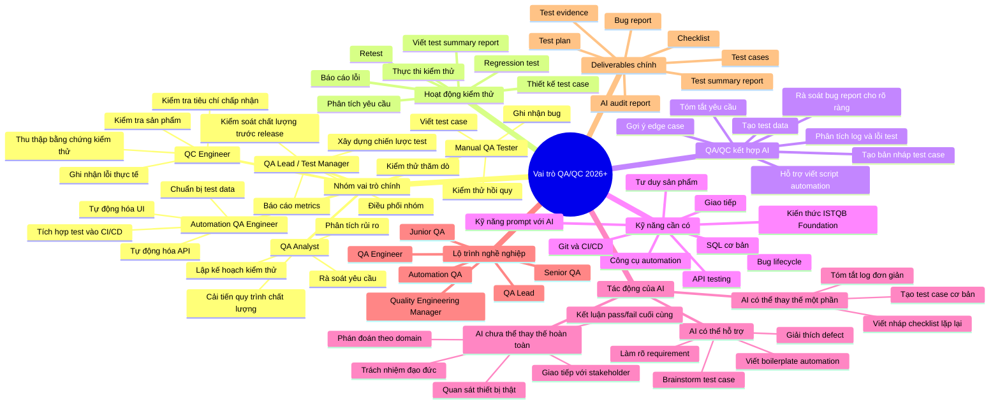

# Mindmap vai trò QA/QC 2026+

## 3 lỗi AI thường tạo ra và phần đã chỉnh sửa

| STT | Lỗi trong mindmap AI tạo | Vì sao sai/chưa đủ | Phần chỉnh sửa của sinh viên |
|---|---|---|---|
| 1 | Gộp QA và QC như cùng một vai trò. | QA thiên về phòng ngừa lỗi, quy trình và kế hoạch chất lượng; QC thiên về kiểm tra sản phẩm/kết quả đầu ra. | Tách riêng nhóm việc của QA Analyst/QA Lead và QC Engineer. |
| 2 | Diễn đạt như kiểm thử chỉ bắt đầu sau khi code xong. | Theo tư duy kiểm thử hiện đại, testing có thể bắt đầu từ giai đoạn review requirement, phân tích rủi ro và thiết kế test. | Bổ sung các nhánh phân tích yêu cầu, risk analysis và test planning trước test execution. |
| 3 | Cho rằng AI có thể thay thế hoàn toàn QA/QC engineer. | AI hỗ trợ tốt việc viết nháp, tóm tắt và gợi ý, nhưng không thể tự quan sát thiết bị thật, chịu trách nhiệm chất lượng hoặc đưa kết luận cuối cùng thay con người. | Đưa AI vào nhóm “hỗ trợ”, còn quan sát thực tế, phán đoán domain và verdict cuối cùng vẫn thuộc về QA/QC. |

## Ghi chú ngắn

Mindmap này thể hiện vai trò QA/QC không chỉ là chạy test, mà còn gồm phân tích yêu cầu, thiết kế kiểm thử, báo cáo lỗi, phối hợp với nhóm phát triển và ra quyết định chất lượng. AI có thể giúp tăng tốc các phần việc lặp lại hoặc tạo bản nháp, nhưng người kiểm thử vẫn phải kiểm chứng, thực thi trên sản phẩm thật, thu thập bằng chứng và chịu trách nhiệm với kết luận cuối cùng.
