# HW01 – QA/QC Jobs · 20 Defects · Test a Physical Product

**Họ tên sinh viên:** Ngô Bảo Long  
**MSSV:** 23127219  
**Môn/Bài tập:** HW01 – QA/QC Jobs · 20 Defects · Test a Physical Product  

---

## Phần I. Requirement 1 – Thị trường việc làm QA/QC 2026+

**Ngày thu thập thông tin:** 07/06/2026  

### 1. Bảng tổng hợp các tin tuyển dụng

| STT | Vị trí | Công ty | Nền tảng | Mức lương | Yêu cầu AI/LLM |
|---:|---|---|---|---|---|
| 1 | QC Manager - Korean Language | Công Ty TNHH Intellipro Việt Nam | TopCV | Thoả thuận | No |
| 2 | Trưởng Nhóm QC Đo Kiểm CNC (Kỹ Thuật Viên Giỏi Có Thể Đào Tạo) | CÔNG TY TNHH CTI VN | TopCV | 12 - 22 triệu | No |
| 3 | Nhân Viên QC - Thu Nhập Lên Đến 22 Triệu - Hồ Chí Minh | CÔNG TY TNHH J-LONG VIỆT NAM | TopCV | 20 - 22 triệu | No |
| 4 | Trưởng Phòng QA-QC (Tuyển Nam) Thu Nhập 25 Triệu - 30 Triệu | Công ty Cổ phần TP Solar | TopCV | 25 - 30 triệu | No |
| 5 | Tester (QA/QC) - Lĩnh Vực Tài Chính | Investingpro Joint Stock Company | TopCV | Lương thỏa thuận (upto 20tr) | No |
| 6 | Nhân Viên Kiểm Tra Chất Lượng | STELLAPHARM | TopCV | 9 - 12 triệu | No |
| 7 | QA Engineer — VibeX-Generated Apps (QA QC, Tester) | MetaCrew | ITViec | Attractive salary | Yes |
| 8 | QA / QC Intern | Flowmingo AI | TopCV | Không đề cập | Yes |
| 9 | Senior QC (Automation Tester, QA QC) | PNJ | ITViec | 1,000 - 1,500 USD | Yes |
| 10 | Senior Manual Test Engineer (QA/QC) | KMS Technology | ITViec | Attractive | Yes |

### 2. Phân tích chi tiết từng tin tuyển dụng

#### Job 01 – QC Manager - Korean Language

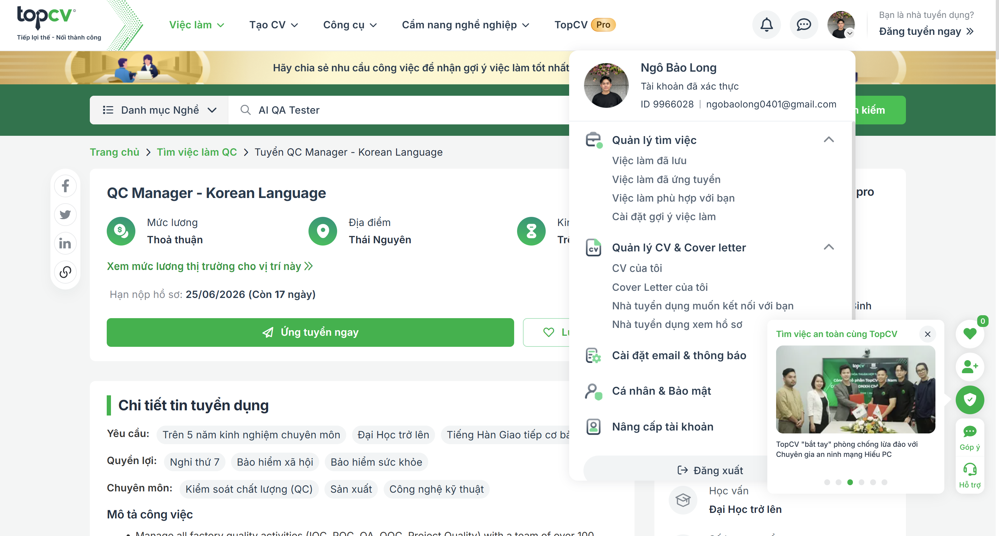

##### Thông tin chung

- **Link:** https://www.topcv.vn/viec-lam/qc-manager-korean-language/2177750.html?ta_source=JobSearchList_LinkDetail&u_sr_id=zQPhwMAnqHJ2ZuS64YQHNOaNayCSqmhcCFMsUd1Z_1780830754
- **Ngày chụp minh chứng:** 7/6/2026
- **Vị trí:** QC Manager - Korean Language
- **Công ty:** Công Ty TNHH Intellipro Việt Nam
- **Nền tảng:** TopCV
- **Mức lương:** Thoả thuận
- **Yêu cầu AI/LLM:** No

##### Mô tả công việc

Manage all factory quality activities (IQC, PQC, QA, OQC, Project Quality) with a team of over 100 employees.</br>

Develop and implement quality strategies, ensuring a balance between Quality – Delivery – Cost.

Operate and continuously improve management systems in accordance with international standards: IATF 16949, ISO 9001, VDA 6.3.

Handle customer complaints, conduct root cause analysis, and apply methodologies such as 8D, PDCA, and DMAIC.

Perform internal audits and supplier audits; propose and monitor improvement action plans.

Work directly with global customers such as Samsung, Hyundai, Bosch, Apple, Sony, etc.

##### Kỹ năng yêu cầu

Bachelor’s degree in Engineering or a related technical field.

Language: Proficiency in Korean is required.

At least 10 years of experience in quality management in large manufacturing plants, including a minimum of 5 years in a managerial/Head position.

Strong knowledge of IATF 16949, ISO 9001, Lean Six Sigma; VDA 6.3 and Six Sigma Black Belt certification is preferred.

Strong team management, problem-solving, and communication skills.

##### Phân tích tác động của AI

AI có thể hỗ trợ vị trí này bằng cách phân tích dữ liệu chất lượng trong nhà máy, phát hiện các mẫu lỗi lặp lại và hỗ trợ lập báo cáo phân tích nguyên nhân gốc theo các phương pháp như 8D, PDCA và DMAIC. Tuy nhiên, vai trò QC Manager không thể được thay thế hoàn toàn bởi AI vì công việc này đòi hỏi năng lực lãnh đạo, ra quyết định, xử lý khiếu nại khách hàng và phối hợp với nhiều bộ phận trong môi trường sản xuất thực tế. AI phù hợp hơn với vai trò công cụ hỗ trợ phân tích và quản lý dữ liệu chất lượng.

---

#### Job 02 – Trưởng Nhóm QC Đo Kiểm CNC (Kỹ Thuật Viên Giỏi Có Thể Đào Tạo)

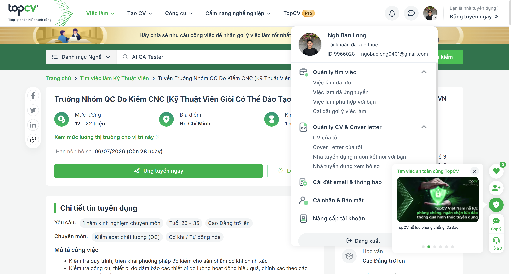

##### Thông tin chung

- **Link:** https://www.topcv.vn/viec-lam/truong-nhom-qc-do-kiem-cnc-ky-thuat-vien-gioi-co-the-dao-tao/2148206.html?ta_source=JobSearchList_LinkDetail&u_sr_id=zQPhwMAnqHJ2ZuS64YQHNOaNayCSqmhcCFMsUd1Z_1780830754
- **Ngày chụp minh chứng:** 7/6/2026
- **Vị trí:** Trưởng Nhóm QC Đo Kiểm CNC (Kỹ Thuật Viên Giỏi Có Thể Đào Tạo)
- **Công ty:** CÔNG TY TNHH CTI VN
- **Nền tảng:** TopCV
- **Mức lương:** 12 - 22 triệu
- **Yêu cầu AI/LLM:** No

##### Mô tả công việc

Kiểm tra quy trình, triển khai phương pháp đo kiểm cho sản phẩm cơ khí chính xác

Kiểm tra công cụ, thiết bị đo đảm bảo các thiết bị đo lường hoạt động hiệu quả, chính xác theo các hướng dẫn vận hành đã ban hành.

Kiểm tra chất lượng sản phẩm tại công đoạn, xuất hàng theo tiêu chuẩn của bản vẽ, tiêu chuẩn của Công ty

Chịu trách nhiệm giám sát về kết quả đo kiểm chất lượng sản phẩm mẫu.

Giải quyết những khiếu nại khách hàng liên quan đến chất lượng sản phẩm. Phân tích nguyên nhận hàng lỗi và đề xuất khắc phục cải tiến.

Tham gia cuộc họp với các phòng ban liên quan về chất lượng sản phẩm. Báo cáo kịp thời các sự cố phát sinh.

Dựa vào kết quả kiểm tra phán định chất lượng sản phẩm thông báo đến bộ phận liên quan.

Dựa vào quy trình công nghệ phân loại hàng hóa để xác định mức độ ưu tiên để kiểm tra, chuyển sản đến công đoạn tiếp theo theo quy trình công nghệ.

Phân công trách nhiệm công việc cho nhân viên. Kiểm tra, giám sát đôn đốc nhân viên hoàn thành công việc đúng tiến độ, tuân thủ quy trình của hệ thống chất lượng.

Duy trì hệ thống chất lượng ISO 9001:2015.

##### Kỹ năng yêu cầu

Trình độ: tốt nghiệp Cao Đẳng hoặc Đại học ưu tiên chuyên ngành cơ khí, chế tạo máy...

Độ tuổi: 23 – 35 tuổi

Kinh nghiệm: Từ 1 năm ở vị trí quản lý hoặc từ 3 năm vị trí nhân viên đo kiểm

Nếu chưa có kinh nghiệm quản lý có thể đào tạo lên Trưởng nhóm từ vị trí kỹ thuật viên đo kiểm (Lương 10-15 triệu)

Biết sử dụng và lập trình máy đo CMM, VMM (Bắt buộc)

Biết sử dụng các công cụ, thiết bị đo lường: Panme, thước cặp, thước đo chiều sâu, máy đo độ nhám, độ dày lớp mạ, đồng hồ so, thước đo chiều cao, ...

Biết sử dụng các phần mềm Autocad, Solidworks, tin học văn phòng cơ bản.

Có định hướng phát triển nghề nghiệp kiểm tra, đo lường sản phẩm chất lượng cao, chịu khó học tập nâng cao năng lực

Phù hợp với văn hóa và gắn bó lâu dài với công ty

##### Phân tích tác động của AI

AI có thể hỗ trợ công việc này bằng cách phân tích kết quả đo kiểm, phát hiện xu hướng bất thường trong dữ liệu chất lượng và tạo báo cáo kiểm tra nhanh hơn. Tuy nhiên, công việc đo kiểm CNC vẫn phụ thuộc nhiều vào thiết bị vật lý như CMM, VMM và các dụng cụ đo chính xác, nên kinh nghiệm kỹ thuật của con người vẫn rất quan trọng. AI có thể giảm tải phần báo cáo và phân tích dữ liệu, nhưng không thể thay thế hoàn toàn việc kiểm tra trực tiếp và phán định chất lượng trên sản phẩm thực tế.

---

#### Job 03 – Nhân Viên QC - Thu Nhập Lên Đến 22 Triệu - Hồ Chí Minh

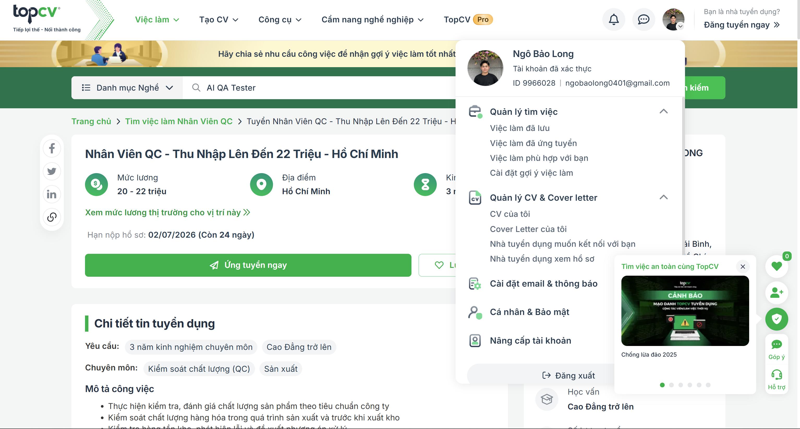

##### Thông tin chung

- **Link:** https://www.topcv.vn/viec-lam/nhan-vien-qc-thu-nhap-len-den-22-trieu-ho-chi-minh/2184735.html?ta_source=JobSearchList_LinkDetail&u_sr_id=zQPhwMAnqHJ2ZuS64YQHNOaNayCSqmhcCFMsUd1Z_1780848295
- **Ngày chụp minh chứng:** 7/6/2026
- **Vị trí:** Nhân Viên QC - Thu Nhập Lên Đến 22 Triệu - Hồ Chí Minh
- **Công ty:** CÔNG TY TNHH J-LONG VIỆT NAM
- **Nền tảng:** TopCV
- **Mức lương:** 20 - 22 triệu
- **Yêu cầu AI/LLM:** No

##### Mô tả công việc

Thực hiện kiểm tra, đánh giá chất lượng sản phẩm theo tiêu chuẩn công ty

Kiểm soát chất lượng hàng hóa trong quá trình sản xuất và trước khi xuất kho

Kiểm tra hàng tồn kho, phát hiện lỗi và đề xuất phương án xử lý

Lập báo cáo kiểm soát chất lượng định kỳ

Áp dụng và giám sát quy trình kiểm tra theo tiêu chuẩn AQL (2.5/4.0)

Phối hợp, hỗ trợ kỹ thuật cho bộ phận kinh doanh và làm việc với nhà máy

Theo dõi, kiểm tra phụ liệu may mặc và quy trình dán nhãn chuyển nhiệt

Thực hiện công tác kiểm tra tại nhà máy (đi công tác thường xuyên)

##### Kỹ năng yêu cầu

Có tối thiểu 3 năm kinh nghiệm ở vị trí QC trong ngành may mặc

Ưu tiên giao tiếp tiếng Anh hoặc tiếng Hoa (Quảng Đông)

Am hiểu về quy trình sản xuất và hoạt động nhà máy

Nắm vững tiêu chuẩn kiểm tra chất lượng (AQL 2.5/4.0)

Hiểu biết về phụ kiện may mặc và kỹ thuật in/dán nhãn chuyển nhiệt

Có khả năng làm việc độc lập và phối hợp tốt với các bộ phận

Sẵn sàng đi công tác thường xuyên

Trung thực, siêng năng, có tinh thần trách nhiệm cao

##### Phân tích tác động của AI

AI có thể hỗ trợ vị trí QC này bằng cách tổng hợp kết quả kiểm tra, tạo báo cáo chất lượng định kỳ và nhận diện các nhóm lỗi thường gặp từ dữ liệu kiểm hàng trước đó. Tuy nhiên, QC trong ngành may mặc vẫn cần kiểm tra trực tiếp bằng mắt, hiểu chất liệu, phụ kiện, nhãn chuyển nhiệt và tiêu chuẩn AQL để đánh giá sản phẩm. Vì vậy, AI chủ yếu giúp tăng hiệu quả xử lý thông tin, còn quyết định chấp nhận hay loại sản phẩm vẫn cần nhân viên QC có kinh nghiệm.

---

#### Job 04 – Trưởng Phòng QA-QC (Tuyển Nam) Thu Nhập 25 Triệu - 30 Triệu

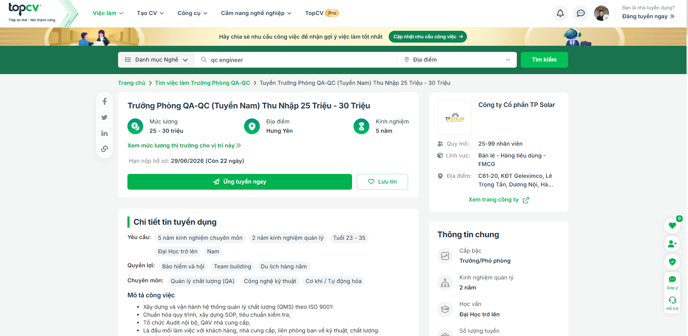

##### Thông tin chung

- **Link:** https://www.topcv.vn/viec-lam/truong-phong-qa-qc-tuyen-nam-thu-nhap-25-trieu-30-trieu/2182354.html?ta_source=JobSearchList_LinkDetail&u_sr_id=zQPhwMAnqHJ2ZuS64YQHNOaNayCSqmhcCFMsUd1Z_1780848295
- **Ngày chụp minh chứng:** 7/6/2026
- **Vị trí:** Trưởng Phòng QA-QC (Tuyển Nam) Thu Nhập 25 Triệu - 30 Triệu
- **Công ty:** Công ty Cổ phần TP Solar
- **Nền tảng:** TopCV
- **Mức lương:** 25 - 30 triệu
- **Yêu cầu AI/LLM:** No

##### Mô tả công việc

Xây dựng và vận hành hệ thống quản lý chất lượng (QMS) theo ISO 9001:

Chuẩn hóa quy trình, xây dựng SOP, tiêu chuẩn kiểm tra,

Tổ chức Audit nội bộ, QAV nhà cung cấp,

Là đầu mối làm việc với khách hàng, nhà cung cấp, liên phòng ban về kỹ thuật, chất lượng.

Là đầu mối làm việc với bên thứ 3 về chứng nhận, kiểm định...

Kiểm soát chất lượng xuyên suốt đầu vào – sản xuất – đầu ra – hậu mãi:

Thiết lập AQL cho IQC, PQC,FQC, OQC

Quản lý PPM

Chịu trách nhiệm nghiên cứu, cải tiến kỹ thuật – sản phẩm, giảm lỗi lặp lại, nâng cao độ ổn định vận hành.

Quản lý sửa chữa hàng lỗi và hàng trả về qua đó thống kê đánh giá chất lượng sản phẩm và cải tiến kỹ thuật.

Biến dữ liệu lỗi và phản hồi thị trường thành đầu vào cho R&D và cải tiến sản phẩm.

Chịu trách nhiệm và phối với với BLĐ R&D sản phẩm mới.

Lập kế hoạch ngân sách & dòng tiền theo từng chu kỳ báo cáo.

Xây dựng công cụ đánh giá hiệu suất, kết quả công việc của phòng ban mình quản lý.

##### Kỹ năng yêu cầu

Giới tính: Nam

Tuổi từ 23 - 35

Tốt nghiệp Đại học trở lên chuyên ngành Điện, điện tử, cơ/cơ khí, kỹ thuật vật liệu,

Kinh nghiệm 5 năm về nghiệp vụ QA/QC hoặc sản xuất và 2 năm làm quản lý chất lượng hoặc vận hành triển khai ISO 9001

Am hiểu cơ bản về: QMS, PPM, CAPA

Hiểu và vận dụng tốt các phương pháp: 5Why, Ishikawa.

Hiểu biết cơ bản về: điện/điện tử, kỹ thuật vật liệu, cơ học vật liệu, công nghệ chế tạo cơ khí(không bắt buộc)

Tư duy hệ thống, cải tiến liên tục.

##### Phân tích tác động của AI

AI có thể hỗ trợ vị trí Trưởng phòng QA-QC bằng cách phân tích dữ liệu lỗi, phản hồi thị trường, dữ liệu bảo hành và chỉ số chất lượng sản xuất để tìm cơ hội cải tiến. Ngoài ra, AI có thể giúp soạn thảo bản nháp SOP, checklist audit và tài liệu CAPA. Tuy nhiên, vai trò này vẫn cần con người để lãnh đạo đội ngũ, làm việc với khách hàng, nhà cung cấp, R&D và đưa ra quyết định kỹ thuật phù hợp với bối cảnh sản xuất.

---

#### Job 05 – Tester (QA/QC) - Lĩnh Vực Tài Chính

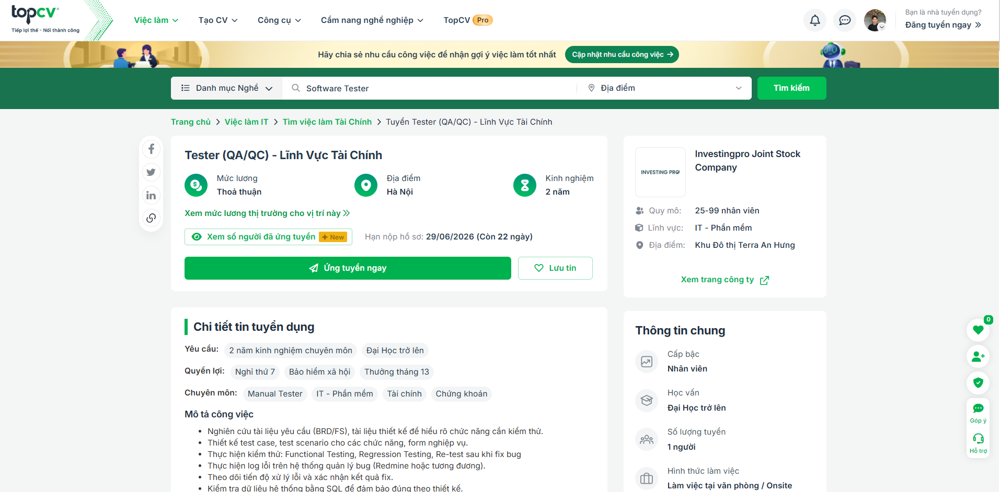

##### Thông tin chung

- **Link:** https://www.topcv.vn/viec-lam/tester-qa-qc-linh-vuc-tai-chinh/2182580.html?ta_source=JobSearchList_LinkDetail&u_sr_id=zQPhwMAnqHJ2ZuS64YQHNOaNayCSqmhcCFMsUd1Z_1780848581
- **Ngày chụp minh chứng:** 7/6/2026
- **Vị trí:** Tester (QA/QC) - Lĩnh Vực Tài Chính
- **Công ty:** Investingpro Joint Stock Company
- **Nền tảng:** TopCV
- **Mức lương:** Lương thỏa thuận (upto 20tr)
- **Yêu cầu AI/LLM:** No

##### Mô tả công việc

Nghiên cứu tài liệu yêu cầu (BRD/FS), tài liệu thiết kế để hiểu rõ chức năng cần kiểm thử.

Thiết kế test case, test scenario cho các chức năng, form nghiệp vụ.

Thực hiện kiểm thử: Functional Testing, Regression Testing, Re-test sau khi fix bug

Thực hiện log lỗi trên hệ thống quản lý bug (Redmine hoặc tương đương).

Theo dõi tiến độ xử lý lỗi và xác nhận kết quả fix.

Kiểm tra dữ liệu hệ thống bằng SQL để đảm bảo đúng theo thiết kế.

Test API bằng Postman.

Phối hợp với Dev, BA trong quá trình làm rõ lỗi và xác nhận yêu cầu.

##### Kỹ năng yêu cầu

2.1. Yêu cầu chung:

Tốt nghiệp Đại học chuyên ngành CNTT hoặc tương đương.

Có kinh nghiệm tester từ 2 năm trở lên

Có tư duy logic tốt, cẩn thận, tỉ mỉ.

Có khả năng đọc hiểu tài liệu nghiệp vụ và tài liệu thiết kế.

Có kỹ năng về: thu thập, phân tích, làm việc nhóm, giao tiếp, phản biện, …

Tinh thần làm việc tích cực, chủ động và có trách nhiệm với công việc

Có kiến thức về Tài chính, Chứng khoán, Chứng chỉ quỹ, Hàng hoá là lợi thế.

2.2. Yêu cầu chuyên môn

Có kinh nghiệm viết test case đầy đủ: input, expected result, pre-condition.

Thành thạo quy trình test và vòng đời bug.

Biết sử dụng công cụ quản lý lỗi (Redmine hoặc tương đương).

Biết sử dụng SQL: Select dữ liệu & Đối chiếu dữ liệu hệ thống

Biết test API bằng Postman.

Có khả năng làm việc nhóm và trao đổi rõ ràng với Dev/BA.

##### Phân tích tác động của AI

AI có thể hỗ trợ tester trong lĩnh vực tài chính bằng cách tạo bản nháp test case từ BRD/FS, đề xuất regression scenarios và hỗ trợ xây dựng ý tưởng kiểm thử SQL hoặc API. Tuy nhiên, kiểm thử phần mềm tài chính yêu cầu hiểu nghiệp vụ rất kỹ vì lỗi nhỏ có thể ảnh hưởng đến giao dịch, số dư, dữ liệu đầu tư hoặc quyết định tài chính của người dùng. Do đó, tester con người vẫn cần kiểm tra logic nghiệp vụ, đánh giá rủi ro và xác nhận kết quả theo đúng yêu cầu hệ thống.

---

#### Job 06 – Nhân Viên Kiểm Tra Chất Lượng

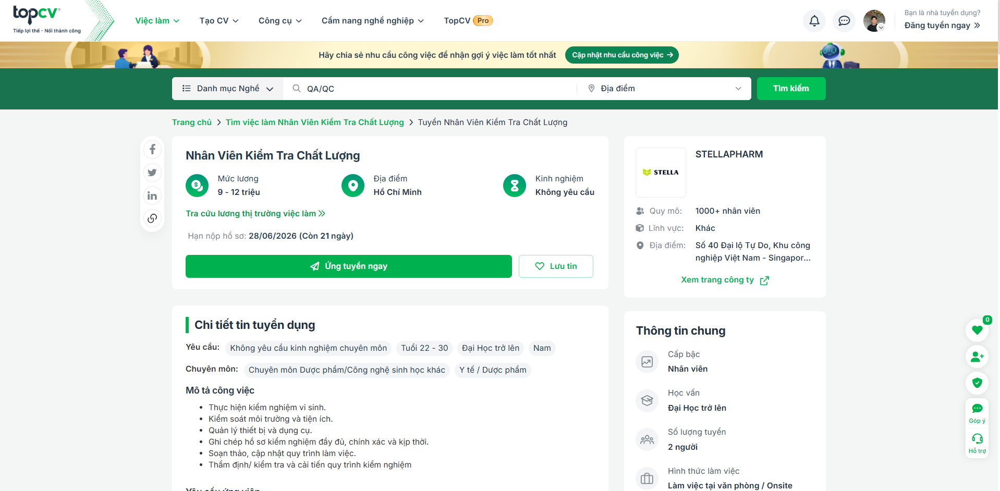

##### Thông tin chung

- **Link:** https://www.topcv.vn/viec-lam/nhan-vien-kiem-tra-chat-luong/2173534.html?ta_source=JobSearchList_LinkDetail&u_sr_id=zQPhwMAnqHJ2ZuS64YQHNOaNayCSqmhcCFMsUd1Z_1780848684
- **Ngày chụp minh chứng:** 7/6/2026
- **Vị trí:** Nhân Viên Kiểm Tra Chất Lượng
- **Công ty:** STELLAPHARM
- **Nền tảng:** TopCV
- **Mức lương:** 9 - 12 triệu
- **Yêu cầu AI/LLM:** No

##### Mô tả công việc

Thực hiện kiểm nghiệm vi sinh.

Kiểm soát môi trường và tiện ích.

Quản lý thiết bị và dụng cụ.

Ghi chép hồ sơ kiểm nghiệm đầy đủ, chính xác và kịp thời.

Soạn thảo, cập nhật quy trình làm việc.

Thẩm định/ kiểm tra và cải tiến quy trình kiểm nghiệm

##### Kỹ năng yêu cầu

Tốt nghiệp Đại học chuyên ngành Vi sinh.

Sức khỏe tốt, nhanh nhẹn, hòa đồng.

Trung thực, cẩn thận, chịu khó, có tinh thần trách nhiệm cao.

Làm việc theo ca

##### Phân tích tác động của AI

AI có thể hỗ trợ vị trí này bằng cách tổ chức hồ sơ kiểm nghiệm, phát hiện xu hướng bất thường trong kết quả vi sinh và hỗ trợ soạn thảo hoặc cập nhật quy trình làm việc. Tuy nhiên, QC trong phòng kiểm nghiệm vẫn yêu cầu thao tác trực tiếp, xử lý mẫu chính xác và tuân thủ quy trình chuyên môn nghiêm ngặt. AI có thể giảm khối lượng công việc hành chính, nhưng không thể thay thế trách nhiệm của nhân viên kiểm nghiệm trong môi trường phòng lab thực tế.

---

#### Job 07 – QA Engineer — VibeX-Generated Apps (QA QC, Tester)

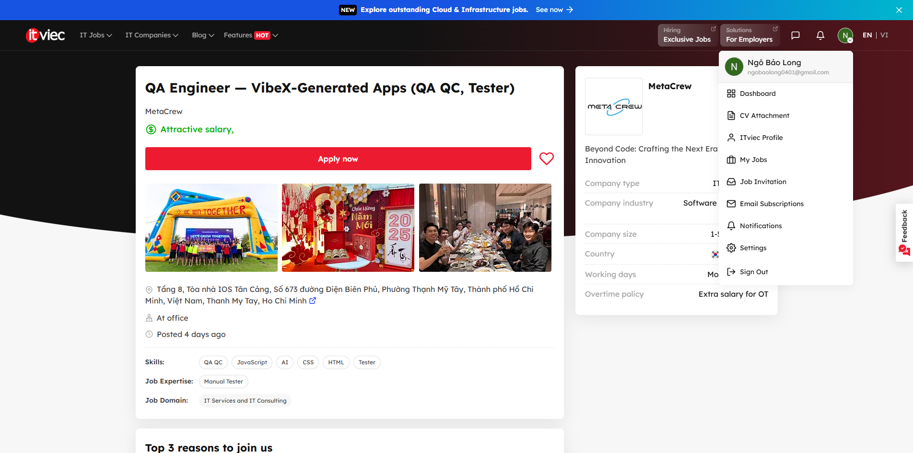

##### Thông tin chung

- **Link:** https://itviec.com/it-jobs/qa-engineer-vibex-generated-apps-qa-qc-tester-metacrew-5045?lab_feature=preview_jd_page
- **Ngày chụp minh chứng:** 7/6/2026
- **Vị trí:** QA Engineer — VibeX-Generated Apps (QA QC, Tester)
- **Công ty:** MetaCrew
- **Nền tảng:** ITViec
- **Mức lương:** Attractive salary
- **Yêu cầu AI/LLM:** Yes

##### Mô tả công việc

GotoX Vietnam (operated by METACREW). GotoX runs VibeX (vibe-x.app) — one of the world's top-tier vibe coding platforms that generates documents, slides, detail pages, and web apps from a single natural language prompt. TalkX, our AI-assistant-powered messenger, is launching soon. We operate across USA, Korea, and Vietnam as a global AI company.

We don't just use AI — we work with AI as a teammate. Armed with Claude, Gemini, and our own VibeX, each person here creates the kind of impact that traditional teams of ten or more used to deliver.

Role Summary:

Verify the quality of web and mobile apps generated by VibeX — and turn what you find into platform improvements. You will work directly with global customers from our HCMC office

You are not a traditional QA Engineer running scripted test cases on a fixed product. You are an AI-powered Quality Operator who owns the full quality loop: from functional testing and bug triage, to pattern analysis of AI-generated outputs, to feeding findings directly back into VibeX's generation pipeline.

KEY RESPONSIBILITIES

App Quality Testing

• Test functionality, UI, responsiveness, performance, and accessibility of apps generated from diverse prompts

• Cross-browser validation: Chrome, Safari, Firefox, Edge

• iOS and Android device testing across real and simulated environments

• Systematically test edge cases: empty inputs, special characters, boundary values, async race conditions

• Evaluate accessibility: screen reader compatibility, keyboard navigation, tab order, ARIA attributes

Bug Reporting & Triage

• Write clear, reproducible bug reports with steps, environment details, expected vs. actual behavior

• Triage issues by severity and business impact — distinguish critical bugs from AI generation limitations

• Identify and flag security vulnerabilities: XSS, input validation gaps, CORS misconfigurations

AI-Powered Test Automation

• Generate AI-powered test cases using Claude, Gemini, or similar tools

• Build regression test scenarios that account for non-deterministic AI outputs

• Develop testing strategies adapted to generative UI — where there is no fixed design spec to compare against

• Automate repetitive validation flows where applicable

Pipeline Feedback & Platform Improvement

• Analyze QA findings to identify systemic patterns in VibeX-generated outputs (e.g., recurring layout breaks at specific breakpoints, consistent logic errors in form handling)

• Translate bug patterns into actionable prompt improvements and generation pipeline recommendations

• Collaborate directly with the VibeX engineering team to feed findings back into model and prompt iteration

• Document and share repeatable QA playbooks with the global team

AI Workflow Innovation

• Continuously discover and integrate new AI tools into your QA workflows

• Develop and refine prompt strategies to reproduce hard-to-replicate AI-generated bugs

• Provide product feedback to the VibeX team based on real testing experience

##### Kỹ năng yêu cầu

MUST-HAVE REQUIREMENTS

Experience

• Proven hands-on track record in web or mobile app QA — you have found, reported, and triaged real bugs in production environments

• Not just internal tools or staging — real products, real users, real impact

• Experience testing both web apps (cross-browser) and mobile apps (iOS / Android)

Technical Foundation

• Basic understanding of HTML, CSS, and JavaScript — able to read code, inspect DOM, and trace layout or logic issues

• Familiarity with browser DevTools for network, console, and element inspection

• Understanding of fundamental web concepts: HTTP requests, API calls, async behavior, responsive design

AI Capability (Critical)

• Daily, hands-on user of AI tools — for test case generation, documentation, and workflow automation

• Able to demonstrate at least one real piece of QA or technical work produced primarily with AI

• Strong prompt engineering instinct: you know how to get AI to generate useful, specific, and structured test cases

• AI capability is our #1 hiring criterion — more important than years of experience

Language

• English: Able to read and write technical documentation, bug reports, and test cases (required). Speaking proficiency is a plus but not mandatory.

• Japanese or Chinese proficiency is an advantage

Mindset

• Detail-obsessed without losing sight of the big picture — you catch bugs others miss, but always ask "does this matter?"

• Self-disciplined with a strong sense of ownership and responsibility

• Fast iteration: bias toward shipping test cycles quickly, learning, and refining

• Pioneer mindset: thrive in uncharted territory where you co-build the QA playbook with the team

NICE TO HAVE

• Experience testing SaaS, dev tools, or AI-generated products

• Familiarity with vibe coding / no-code platforms (VibeX, v0, Lovable, Bolt, etc.)

• Prior startup or solo project experience where you owned QA end-to-end

• Experience with automation frameworks (Playwright, Cypress, Selenium)

• Background in accessibility testing (WCAG standards)

• Understanding of prompt engineering and how LLMs generate UI/code

What to Submit:

1. Your résumé (PDF preferred)

2. One thing you have built or tested with AI — automation, test case, bug report, script, or any real work that shows how you use AI in practice

Important note: AI capability is the #1 hiring criterion. What you have built and tested with AI matters more than your résumé. Show us the work — that's what counts.

HIRING PROCESS

Step 1 — Application Review: We review your application and get back to you promptly.

Step 2 — Pre-Interview

Assignment

Upon shortlisting, you receive a free VibeX Pro plan and two assignments to complete and submit before the interview. One assignment will involve building and testing a VibeX-generated app. This is not just a test — it's your chance to experience what working at GotoX actually feels like.

Step 3 — Interview We will discuss your assignment, your AI workflow, and real bug cases you have found and resolved.

Step 4 — Decision We will communicate the outcome after the interview.

##### Phân tích tác động của AI

AI có tác động trực tiếp đến vị trí này vì sản phẩm được kiểm thử là các web/mobile apps được tạo bởi nền tảng VibeX từ natural language prompt. QA Engineer phải dùng AI để tạo test cases, phân tích lỗi khó tái hiện, kiểm thử các đầu ra không cố định và phản hồi lại cho generation pipeline. Điều này cho thấy AI không loại bỏ vai trò QA, mà chuyển QA sang hướng đánh giá hành vi AI, thiết kế prompt, phân tích pattern lỗi và cải tiến quy trình tạo sản phẩm bằng AI.

---

#### Job 08 – QA / QC Intern

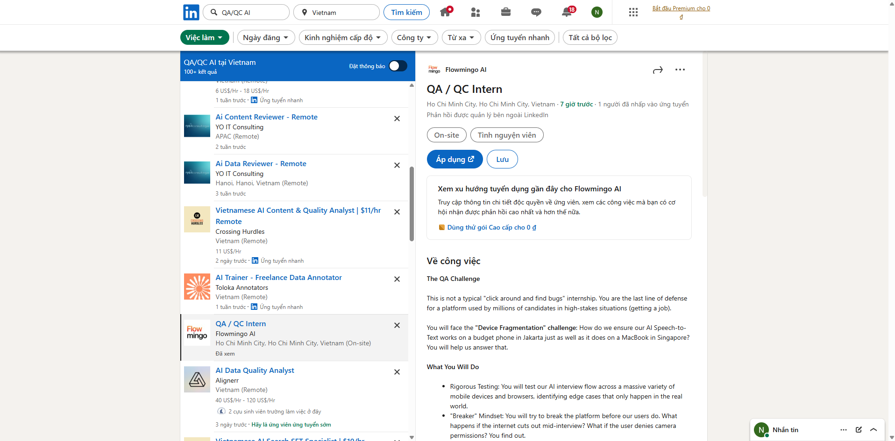

##### Thông tin chung

- **Link:** https://www.linkedin.com/jobs/search/?currentJobId=4425177162&geoId=104195383&keywords=QA%2FQC%20AI&origin=JOB_SEARCH_PAGE_SEARCH_BUTTON&refresh=true
- **Ngày chụp minh chứng:** 7/6/2026
- **Vị trí:** QA / QC Intern
- **Công ty:** Flowmingo AI
- **Nền tảng:** TopCV
- **Mức lương:** Không đề cập
- **Yêu cầu AI/LLM:** Yes

##### Mô tả công việc

Rigorous Testing: You will test our AI interview flow across a massive variety of mobile devices and browsers, identifying edge cases that only happen in the real world.

"Breaker" Mindset: You will try to break the platform before our users do. What happens if the internet cuts out mid-interview? What if the user denies camera permissions? You find out.

Release Management: You will work directly with the Engineering and Product team to green-light releases. If you say "No," we don't ship.

Process Improvement: You will proactively identify gaps in our testing workflow and suggest better ways to catch bugs early, using data from user reports.

Quality Documentation: You will translate messy bug reports into clear, actionable engineering tickets with precise reproduction steps.

##### Kỹ năng yêu cầu

Detail-Obsessed: You notice when a button is 2 pixels off or when a loading spinner spins for too long.

Tech-Savvy: You know how to open the Browser Console (Inspect Element) and look at network errors.

Empathy for the User: You understand that a bug isn't just an error; it's a candidate losing a job opportunity.

Logical Thinker: You can isolate variables to find the root cause of a bug, not just the symptom.

Bonus: A strong interest in tech products, data analytics, or coding, with deep curiosity about how things work "under the hood" is a huge plus.

##### Phân tích tác động của AI

AI ảnh hưởng mạnh đến vị trí này vì sản phẩm cần kiểm thử là một AI interview flow, nơi lỗi kỹ thuật có thể ảnh hưởng trực tiếp đến trải nghiệm và cơ hội việc làm của ứng viên. QA/QC Intern cần kiểm thử nhiều tình huống thực tế như mất mạng giữa buổi phỏng vấn, từ chối quyền camera, lỗi trình duyệt hoặc lỗi thiết bị. AI có thể hỗ trợ gợi ý test scenarios, nhưng sự đồng cảm với người dùng và khả năng đánh giá tác động thực tế của lỗi vẫn cần con người.

---

#### Job 09 – Senior QC (Automation Tester, QA QC)

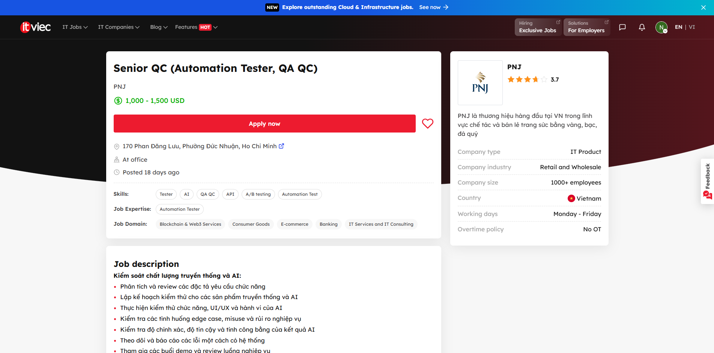

##### Thông tin chung

- **Link:** https://itviec.com/it-jobs/senior-qc-automation-tester-qa-qc-pnj-5542?lab_feature=preview_jd_page
- **Ngày chụp minh chứng:** 7/6/2026
- **Vị trí:** Senior QC (Automation Tester, QA QC)
- **Công ty:** PNJ
- **Nền tảng:** ITViec
- **Mức lương:** 1,000 - 1,500 USD
- **Yêu cầu AI/LLM:** Yes

##### Mô tả công việc

Kiểm soát chất lượng truyền thống và AI:

Phân tích và review các đặc tả yêu cầu chức năng

Lập kế hoạch kiểm thử cho các sản phẩm truyền thống và AI

Thực hiện kiểm thử chức năng, UI/UX và hành vi của AI

Kiểm tra các tình huống edge case, misuse và rủi ro nghiệp vụ

Kiểm tra độ chính xác, độ tin cậy và tính công bằng của kết quả AI

Theo dõi và báo cáo các lỗi một cách có hệ thống

Tham gia các buổi demo và review luồng nghiệp vụ

​Kiểm thử tự động và công cụ AI:

Phát triển các kịch bản kiểm thử tự động

Áp dụng các công cụ kiểm thử AI (LLM evaluation, synthetic data)

Thiết lập và duy trì hệ thống CI/CD cho kiểm thử

Sử dụng công cụ giả lập người dùng để kiểm thử tự động

Phát triển các công cụ nội bộ hỗ trợ kiểm thử AI 

​Đảm bảo chất lượng dữ liệu cho AI:

Kiểm tra tính đầy đủ và chính xác của dữ liệu huấn luyện AI

Đánh giá tính đa dạng và cân bằng của dữ liệu

Kiểm tra việc xử lý dữ liệu cá nhân và tuân thủ bảo mật

Theo dõi hiệu suất mô hình AI theo thời gian

Học hỏi và phát triển:

Nghiên cứu các xu hướng, công cụ và phương pháp kiểm thử AI mới

Chủ động nâng cao tư duy kiểm thử manual + automation, tư duy phân tích rủi ro và tư duy end user

Tham gia các khóa học và hoạt động nâng cao kỹ năng

Chia sẻ kiến thức với đồng nghiệp

##### Kỹ năng yêu cầu

Bằng cấp: Cử Nhân trở lên các chuyên ngành CNTT & Phần mềm

Chuyên ngành:  Khoa Học Máy Tính, Công Nghệ Thông Tin, hoặc các ngành có liên quan

Must-have: 

Tối thiểu 04 năm kinh nghiệm trong lĩnh vực Software Testing Automation ứng dụng AI trong testing

Chủ động, năng động, trách nhiệm cao, kiên định bám mục tiêu

Có khả năng xử lý nhiều dự án song song, biết sắp xếp ưu tiên theo tiến độ công việc

Có tư duy end-user, cẩn thận trong công việc

Giao tiếp tốt, phối hợp hiệu quả với các team liên quan.

Có khả năng phân tích các rủi ro hệ thống

Should-have: 

Có chứng chỉ ISTQB, Agile hoặc các chứng chỉ tương đương là điểm cộng.

##### Phân tích tác động của AI

AI có tác động rất lớn đến vị trí này vì tester phải kiểm tra cả sản phẩm truyền thống lẫn sản phẩm AI, bao gồm độ chính xác, độ tin cậy, tính công bằng, dữ liệu huấn luyện và hiệu suất mô hình theo thời gian. Công việc này vượt ra ngoài automation testing thông thường vì kết quả AI có thể không hoàn toàn cố định như phần mềm truyền thống. QA con người vẫn giữ vai trò quan trọng trong việc xác định tiêu chí đánh giá, phát hiện rủi ro nghiệp vụ và quyết định hành vi AI có chấp nhận được trong thực tế hay không.

---

#### Job 10 – Senior Manual Test Engineer (QA/QC)

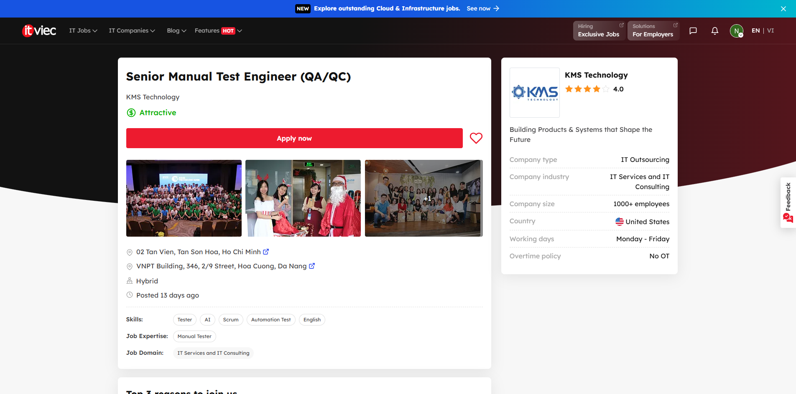

##### Thông tin chung

- **Link:** https://itviec.com/it-jobs/senior-manual-test-engineer-qa-qc-kms-technology-3100?lab_feature=preview_jd_page
- **Ngày chụp minh chứng:** 7/6/2026
- **Vị trí:** Senior Manual Test Engineer (QA/QC)
- **Công ty:** KMS Technology
- **Nền tảng:** ITViec
- **Mức lương:** Attractive
- **Yêu cầu AI/LLM:** Yes

##### Mô tả công việc

Perform all testing activities to improve product quality, work closely with the team (developers, business analysis, customer service, operations, etc.) to deliver product success.

Shows creativity and initiative to improve product test coverage and effectiveness.

Address the test needs in a methodical, detail-oriented manner with the help of robust analytical skills and problem-solving capacity.

Involve initiatives to support product growth, such as competitor research, customer troubleshooting, etc.

Mentor and coach junior QA engineers to improve their testing skills.

Participate in sprint planning and work closely with the Scrum team to analyze requirements and provide necessary QA/test recommendations.

Collaborate closely with clients, ensure effective communication, and proactively resolve issues arising during testing.

##### Kỹ năng yêu cầu

General requirements:

Bachelor's degree in Computer Science, Information Technology, or a related field.

Intermediate level of English proficiency, with strong communication skills.

5+ years of hands-on experience in software testing.

Experience in mentoring, coaching, and sharing best practices with other team members.

Proven ability to work independently while also leading testing activities within the team.

Strong problem-solving and analytical skills with a focus on quality.

Good communication skills and ability to collaborate effectively with cross-functional teams.

Open, proactive, and willing to continuously learn and adapt.

Familiar with the Agile development methodologies.

Excellent collaboration skills with a proven ability to work seamlessly with both customers and team members.

Technical requirements:

Experience in software testing for web-based applications.

Solid testing experiences (test strategy, test approach, test plan, test techniques included black box, risk-based, exploratory, Non-UI testing, etc.)

Strong understanding of software development life cycle (SDLC) and software testing life cycle (STLC).

Methodical and detail-oriented, with solid analytical skills and problem-solving ability.

Strong dedication to quality and a positive, collaborative attitude and approach to testing.

Nice to have:

Experience in creating and running automated tests using testing frameworks like Katalon/ Selenium/ Robotium/ UiAutomator/ XCTest/ XCUiTest, etc.

Hands-on experience in using test tools like TestNG/ Mocha/ Jasmine/ Nightwatch, etc.

Proficient daily use of AI coding tools (Copilot, Cursor, Claude Code) across the full SDLC

Able to decompose complex tasks, provide effective context, and apply chain-of-thought and multi-step prompting workflows

Experience with agentic workflows and AI-driven development frameworks

Hands-on experience integrating AI tools with other systems via MCP (Model Context Protocol) or equivalent

Awareness of emerging AI tools and willingness to evaluate and adopt new capabilities

##### Phân tích tác động của AI

AI có thể hỗ trợ Senior Manual Test Engineer bằng cách giúp phân rã yêu cầu phức tạp, tạo ý tưởng kiểm thử, tóm tắt requirement và hỗ trợ các workflow phát triển có dùng AI. Tuy nhiên, vị trí senior vẫn phụ thuộc nhiều vào kinh nghiệm con người trong việc mentor junior QA, làm việc với khách hàng, đánh giá rủi ro sản phẩm và lựa chọn test strategy phù hợp. AI là công cụ tăng năng suất tốt, nhưng không thay thế được tư duy phản biện, khả năng giao tiếp và trách nhiệm chất lượng của một senior QA engineer.

---

## Phần II. Requirement 2 – 20 Software Defects Publicized Between 2022 and 2026

### Bảng tóm tắt 20 defects

| # | Năm công khai | Defect | Nhóm | Mức độ |
|---|---:|---|---|---|
| 1 | 2022 | Atlassian Confluence RCE – CVE-2022-26134 | Security defect | Critical |
| 2 | 2022 | Microsoft MSDT “Follina” – CVE-2022-30190 | Security defect | High |
| 3 | 2022 | Spring Framework “Spring4Shell” – CVE-2022-22965 | Security defect | Critical |
| 4 | 2022 | OpenSSL X.509 Buffer Overflow – CVE-2022-3602 | Security defect | High |
| 5 | 2022 | VMware Workspace ONE Access RCE – CVE-2022-22954 | Security defect | Critical |
| 6 | 2023 | MOVEit Transfer SQL Injection – CVE-2023-34362 | Security defect | Critical |
| 7 | 2023 | CitrixBleed – CVE-2023-4966 | Security defect | Critical |
| 8 | 2023 | Barracuda Email Security Gateway – CVE-2023-2868 | Security defect | Critical |
| 9 | 2023 | Cisco IOS XE Web UI – CVE-2023-20198 | Security defect | Critical |
| 10 | 2023 | ownCloud GraphAPI credential disclosure – CVE-2023-49103 | Security defect | Critical |
| 11 | 2024 | XZ Utils Backdoor – CVE-2024-3094 | Supply-chain defect | Critical |
| 12 | 2024 | CrowdStrike Falcon faulty content update | Software update defect | Critical |
| 13 | 2024 | Ivanti Connect Secure auth bypass – CVE-2023-46805 | Security defect | Critical |
| 14 | 2025 | Microsoft SharePoint “ToolShell” – CVE-2025-53770 | Security defect | Critical |
| 15 | 2026 | Palo Alto PAN-OS GlobalProtect auth bypass – CVE-2026-0257 | Security defect | Critical |
| 16 | 2023 | ChatGPT Redis/redis-py data leak incident | AI/LLM defect | High |
| 17 | 2023 | Google Bard demo hallucination | AI/LLM defect | Medium–High |
| 18 | 2023 | ChatGPT fake legal cases in Mata v. Avianca | AI/LLM defect | High |
| 19 | 2023 | iTutorGroup automated hiring age bias | AI/bias defect | High |
| 20 | 2024 | Google AI Overviews hallucinated answers | AI/LLM defect | Medium–High |

---

### 1. Atlassian Confluence RCE – CVE-2022-26134

**Source links:**
- NVD: https://nvd.nist.gov/vuln/detail/CVE-2022-26134
- Atlassian advisory: https://confluence.atlassian.com/security/cve-2022-26134-critical-severity-unauthenticated-remote-code-execution-vulnerability-in-confluence-data-center-and-server-1130377146.html
- CISA KEV catalog: https://www.cisa.gov/known-exploited-vulnerabilities-catalog

**Description:**  
CVE-2022-26134 là lỗ hổng remote code execution trong Atlassian Confluence Server và Data Center. Kẻ tấn công có thể khai thác từ xa trong một số cấu hình bị ảnh hưởng mà không cần xác thực.

**Severity:** Critical.

**Consequences:**  
Máy chủ Confluence có thể bị chiếm quyền điều khiển, bị cài web shell, rò rỉ dữ liệu nội bộ hoặc trở thành điểm xâm nhập vào hệ thống doanh nghiệp.

**Solution:**  
Cập nhật Confluence lên phiên bản đã vá theo advisory của Atlassian. Nếu chưa thể cập nhật ngay, áp dụng biện pháp giảm thiểu chính thức, kiểm tra dấu hiệu xâm nhập, xoay vòng credential nhạy cảm nếu nghi ngờ bị compromise.

**AI bias/hallucination instance:**  
Một AI có thể nói sai rằng “đây chỉ là lỗi XSS giao diện và không thể dẫn tới chiếm quyền máy chủ”. Đây là hallucination vì defect được công bố là RCE, mức Critical.

---

### 2. Microsoft MSDT “Follina” – CVE-2022-30190

**Source links:**
- Microsoft MSRC: https://msrc.microsoft.com/update-guide/vulnerability/CVE-2022-30190
- NVD: https://nvd.nist.gov/vuln/detail/CVE-2022-30190
- CISA alert: https://www.cisa.gov/news-events/alerts/2022/05/31/microsoft-releases-workaround-guidance-msdt-follina-vulnerability

**Description:**  
CVE-2022-30190, thường được gọi là Follina, là lỗ hổng trong Microsoft Windows Support Diagnostic Tool. Lỗi này cho phép remote code execution khi người dùng mở hoặc preview tài liệu độc hại gọi MSDT thông qua URL protocol.

**Severity:** High.

**Consequences:**  
Người dùng có thể bị thực thi mã độc thông qua tài liệu Office hoặc file được dựng sẵn, dẫn đến cài malware, đánh cắp dữ liệu hoặc di chuyển ngang trong mạng nội bộ.

**Solution:**  
Cài bản vá của Microsoft, vô hiệu hóa MSDT URL protocol theo hướng dẫn tạm thời nếu chưa vá, tăng cường kiểm soát email/phishing và EDR.

**AI bias/hallucination instance:**  
Một AI có thể bịa rằng “Follina chỉ ảnh hưởng Microsoft Word 2016”. Đây là hallucination vì lỗi nằm ở MSDT/Windows và có thể bị kích hoạt qua nhiều vector liên quan tài liệu hoặc preview.

---

### 3. Spring Framework “Spring4Shell” – CVE-2022-22965

**Source links:**
- Spring official advisory: https://spring.io/security/cve-2022-22965
- NVD: https://nvd.nist.gov/vuln/detail/CVE-2022-22965
- CISA KEV catalog: https://www.cisa.gov/known-exploited-vulnerabilities-catalog

**Description:**  
CVE-2022-22965 là lỗ hổng remote code execution trong Spring Framework. Lỗi liên quan đến data binding và có thể bị khai thác trong một số điều kiện triển khai nhất định.

**Severity:** Critical.

**Consequences:**  
Ứng dụng Java/Spring dễ bị chiếm quyền thực thi mã, bị upload web shell hoặc bị kiểm soát server nếu thỏa điều kiện khai thác.

**Solution:**  
Cập nhật Spring Framework/Spring Boot lên phiên bản đã vá, kiểm tra cấu hình deployment, hạn chế binding các object nhạy cảm, theo dõi log truy cập bất thường.

**AI bias/hallucination instance:**  
Một AI có thể nói sai rằng “Spring4Shell là bản sao y hệt Log4Shell”. Đây là hallucination vì hai lỗi nằm ở thư viện khác nhau, cơ chế khác nhau và điều kiện khai thác khác nhau.

---

### 4. OpenSSL X.509 Buffer Overflow – CVE-2022-3602

**Source links:**
- OpenSSL advisory: https://www.openssl.org/news/secadv/20221101.txt
- NVD: https://nvd.nist.gov/vuln/detail/CVE-2022-3602

**Description:**  
CVE-2022-3602 là lỗi buffer overflow trong OpenSSL liên quan xử lý certificate X.509, cụ thể là phần punycode trong email address constraint.

**Severity:** High. Ban đầu có lo ngại rất lớn, nhưng OpenSSL sau đó đánh giá lại không phải Critical trong advisory chính thức.

**Consequences:**  
Có thể gây crash hoặc trong điều kiện nhất định có khả năng dẫn tới thực thi mã. Các hệ thống dùng OpenSSL phiên bản bị ảnh hưởng cần được vá nhanh.

**Solution:**  
Cập nhật OpenSSL lên phiên bản đã vá, kiểm kê hệ thống phụ thuộc OpenSSL, rebuild/redeploy ứng dụng nếu chúng statically link OpenSSL.

**AI bias/hallucination instance:**  
Một AI có thể nói rằng “CVE-2022-3602 là Heartbleed 2.0 và chắc chắn cho phép đọc toàn bộ bộ nhớ server”. Đây là hallucination vì advisory chính thức mô tả lỗi khác Heartbleed và mức độ đã được đánh giá lại.

---

### 5. VMware Workspace ONE Access RCE – CVE-2022-22954

**Source links:**
- VMware advisory VMSA-2022-0011: https://www.vmware.com/security/advisories/VMSA-2022-0011.html
- NVD: https://nvd.nist.gov/vuln/detail/CVE-2022-22954
- CISA KEV catalog: https://www.cisa.gov/known-exploited-vulnerabilities-catalog

**Description:**  
CVE-2022-22954 là lỗ hổng server-side template injection trong VMware Workspace ONE Access và VMware Identity Manager, có thể dẫn đến remote code execution.

**Severity:** Critical.

**Consequences:**  
Hệ thống identity/access management bị compromise có thể gây hậu quả nghiêm trọng: chiếm quyền hệ thống, đánh cắp tài khoản, mở rộng truy cập vào các dịch vụ nội bộ.

**Solution:**  
Cài bản vá theo VMSA-2022-0011, hạn chế truy cập từ Internet, kiểm tra indicator of compromise và rà soát tài khoản/quyền truy cập.

**AI bias/hallucination instance:**  
Một AI có thể nhầm rằng “lỗi này chỉ ảnh hưởng VMware vCenter”. Đây là hallucination vì advisory chỉ rõ Workspace ONE Access/Identity Manager và một số sản phẩm liên quan, không phải vCenter là trọng tâm của CVE này.

---

### 6. MOVEit Transfer SQL Injection – CVE-2023-34362

**Source links:**
- Progress MOVEit advisory: https://community.progress.com/s/article/MOVEit-Transfer-Critical-Vulnerability-31May2023
- NVD: https://nvd.nist.gov/vuln/detail/CVE-2023-34362
- CISA alert: https://www.cisa.gov/news-events/cybersecurity-advisories/aa23-158a

**Description:**  
CVE-2023-34362 là SQL injection trong MOVEit Transfer, phần mềm truyền file quản trị bởi Progress. Lỗ hổng bị khai thác quy mô lớn.

**Severity:** Critical.

**Consequences:**  
Nhiều tổ chức bị đánh cắp dữ liệu qua máy chủ MOVEit, dẫn đến rò rỉ thông tin cá nhân, tài chính, hồ sơ nhân sự và chi phí xử lý sự cố lớn.

**Solution:**  
Cập nhật MOVEit Transfer theo advisory của Progress, vô hiệu hóa HTTP/HTTPS tạm thời nếu cần, kiểm tra dấu hiệu xâm nhập, rà soát tài khoản và dữ liệu bị truy cập.

**AI bias/hallucination instance:**  
Một AI có thể nói rằng “MOVEit là lỗi ransomware trong hệ điều hành Windows”. Đây là hallucination vì defect chính là SQL injection trong ứng dụng MOVEit Transfer.

---

### 7. CitrixBleed – CVE-2023-4966

**Source links:**
- Citrix advisory: https://support.citrix.com/article/CTX579459/netscaler-adc-and-netscaler-gateway-security-bulletin-for-cve20234966-and-cve20234967
- NVD: https://nvd.nist.gov/vuln/detail/CVE-2023-4966
- CISA KEV catalog: https://www.cisa.gov/known-exploited-vulnerabilities-catalog

**Description:**  
CVE-2023-4966, thường gọi là CitrixBleed, là lỗi trong NetScaler ADC và NetScaler Gateway cho phép lộ thông tin nhạy cảm, bao gồm session token trong một số trường hợp.

**Severity:** Critical.

**Consequences:**  
Kẻ tấn công có thể chiếm session hợp lệ, bypass đăng nhập, truy cập hệ thống VPN/gateway và mở đường cho xâm nhập nội bộ.

**Solution:**  
Cập nhật firmware NetScaler theo advisory của Citrix, hủy session cũ, kiểm tra log bất thường, xoay vòng credential nếu nghi ngờ bị lộ.

**AI bias/hallucination instance:**  
Một AI có thể nói rằng “CitrixBleed là lỗi làm rò rỉ private key TLS giống Heartbleed”. Đây là hallucination vì lỗi chủ yếu được biết đến với rủi ro lộ session/token, không phải mô tả đúng là rò private key TLS.

---

### 8. Barracuda Email Security Gateway – CVE-2023-2868

**Source links:**
- Barracuda advisory: https://www.barracuda.com/company/legal/esg-vulnerability
- NVD: https://nvd.nist.gov/vuln/detail/CVE-2023-2868
- CISA alert: https://www.cisa.gov/news-events/alerts/2023/05/25/barracuda-email-security-gateway-appliance-vulnerability

**Description:**  
CVE-2023-2868 là lỗ hổng command injection trong Barracuda Email Security Gateway appliance. Điểm nghiêm trọng của sự cố là Barracuda khuyến nghị thay thế appliance bị ảnh hưởng trong một số trường hợp.

**Severity:** Critical.

**Consequences:**  
Thiết bị email gateway có thể bị compromise, dẫn đến gián điệp email, đánh cắp dữ liệu, persistence trong hạ tầng và nguy cơ tấn công chuỗi cung ứng thông tin.

**Solution:**  
Làm theo hướng dẫn của Barracuda: vá, cô lập, thay thế appliance nếu được yêu cầu, rà soát IOC và kiểm tra toàn bộ hệ thống email.

**AI bias/hallucination instance:**  
Một AI có thể khẳng định “chỉ cần đổi mật khẩu email là xử lý xong CVE-2023-2868”. Đây là hallucination nguy hiểm vì vendor advisory có hướng xử lý mạnh hơn, gồm vá/cô lập/thay thế appliance trong trường hợp bị ảnh hưởng.

---

### 9. Cisco IOS XE Web UI – CVE-2023-20198

**Source links:**
- Cisco advisory: https://sec.cloudapps.cisco.com/security/center/content/CiscoSecurityAdvisory/cisco-sa-iosxe-webui-privesc-j22SaA4z
- NVD: https://nvd.nist.gov/vuln/detail/CVE-2023-20198
- CISA alert: https://www.cisa.gov/news-events/alerts/2023/10/18/cisa-releases-emergency-directive-mitigate-cisco-ios-xe-web-ui-vulnerabilities

**Description:**  
CVE-2023-20198 là lỗi privilege escalation trong Cisco IOS XE Web UI khi tính năng web UI được bật và exposed ra Internet hoặc mạng không tin cậy.

**Severity:** Critical.

**Consequences:**  
Thiết bị mạng có thể bị tạo tài khoản đặc quyền, bị cài implant hoặc bị dùng làm điểm điều khiển lưu lượng mạng.

**Solution:**  
Tắt HTTP Server/Web UI nếu không cần, cập nhật bản vá Cisco, rà soát user lạ và IOC, giới hạn truy cập quản trị chỉ từ mạng tin cậy.

**AI bias/hallucination instance:**  
Một AI có thể nói rằng “mọi router Cisco đều tự động bị ảnh hưởng”. Đây là hallucination vì điều kiện quan trọng là thiết bị IOS XE có Web UI/HTTP Server cấu hình bị phơi ra theo advisory.

---

### 10. ownCloud GraphAPI credential disclosure – CVE-2023-49103

**Source links:**
- ownCloud advisory: https://owncloud.com/security-advisories/disclosure-of-sensitive-credentials-and-configuration-in-containerized-deployments/
- NVD: https://nvd.nist.gov/vuln/detail/CVE-2023-49103

**Description:**  
CVE-2023-49103 là lỗi lộ thông tin nhạy cảm trong ownCloud GraphAPI, đặc biệt trong một số deployment containerized. Endpoint có thể làm lộ cấu hình và credential.

**Severity:** Critical.

**Consequences:**  
Thông tin cấu hình, mật khẩu database, license key hoặc credential nhạy cảm có thể bị rò rỉ, dẫn đến truy cập trái phép dữ liệu cloud storage.

**Solution:**  
Xóa file test/endpoint theo advisory, cập nhật package, thay đổi credential bị lộ, rà soát truy cập bất thường và cấu hình container.

**AI bias/hallucination instance:**  
Một AI có thể nói rằng “lỗi này chỉ làm lộ username công khai, không ảnh hưởng credential”. Đây là hallucination vì advisory nêu rõ nguy cơ lộ sensitive credentials/configuration.

---

### 11. XZ Utils Backdoor – CVE-2024-3094

**Source links:**
- Red Hat CVE page: https://access.redhat.com/security/cve/cve-2024-3094
- NVD: https://nvd.nist.gov/vuln/detail/CVE-2024-3094
- Red Hat blog: https://www.redhat.com/en/blog/understanding-red-hats-response-xz-security-incident

**Description:**  
CVE-2024-3094 là backdoor được cài vào upstream tarballs của XZ Utils phiên bản 5.6.0 và 5.6.1. Đây là sự cố chuỗi cung ứng nghiêm trọng trong phần mềm mã nguồn mở.

**Severity:** Critical.

**Consequences:**  
Nếu đi vào các bản phân phối production rộng rãi, backdoor có thể ảnh hưởng đến SSH/sshd trong các hệ thống liên kết với liblzma, mở ra nguy cơ truy cập trái phép từ xa.

**Solution:**  
Hạ cấp hoặc gỡ phiên bản XZ bị ảnh hưởng, cập nhật theo distro advisory, kiểm kê hệ thống, xác minh package source và theo dõi IOC từ vendor.

**AI bias/hallucination instance:**  
Một AI có thể nói rằng “đây là lỗi lập trình vô tình do buffer overflow”. Đây là hallucination vì nguồn chính thức mô tả malicious code/backdoor trong supply chain, không phải bug vô ý thông thường.

---

### 12. CrowdStrike Falcon faulty content update

**Source links:**
- CrowdStrike preliminary post incident review: https://www.crowdstrike.com/falcon-content-update-remediation-and-guidance-hub/
- Reuters report: https://www.reuters.com/technology/crowdstrike-says-bug-quality-control-process-led-botched-update-2024-07-24/
- AP News report: https://apnews.com/article/aa1e9c84ee34bc38aca69731d9d3b9a7

**Description:**  
Tháng 7/2024, một bản cập nhật nội dung lỗi của CrowdStrike Falcon gây crash trên nhiều máy Windows. Reuters và AP đưa tin sự cố ảnh hưởng khoảng 8.5 triệu thiết bị Windows và gây gián đoạn hàng không, ngân hàng, bệnh viện, bán lẻ và truyền thông.

**Severity:** Critical.

**Consequences:**  
Nhiều máy Windows bị BSOD, hoạt động doanh nghiệp bị đình trệ, chuyến bay bị hủy/trễ, dịch vụ y tế và tài chính bị gián đoạn, thiệt hại kinh tế lớn.

**Solution:**  
CrowdStrike thu hồi/sửa bản cập nhật lỗi, cung cấp hướng dẫn remediation, cải thiện quy trình kiểm thử và kiểm soát chất lượng trước khi phát hành nội dung mới.

**AI bias/hallucination instance:**  
Một AI có thể nói rằng “đây là cyberattack do hacker tấn công CrowdStrike”. Đây là hallucination vì các nguồn chính thống mô tả đây là faulty update/quality-control bug, không phải một cuộc tấn công mạng.

---

### 13. Ivanti Connect Secure auth bypass – CVE-2023-46805

**Source links:**
- Ivanti advisory: https://forums.ivanti.com/s/article/CVE-2023-46805-Authentication-Bypass-CVE-2024-21887-Command-Injection-for-Ivanti-Connect-Secure-and-Ivanti-Policy-Secure-Gateways
- NVD: https://nvd.nist.gov/vuln/detail/CVE-2023-46805
- CISA alert: https://www.cisa.gov/news-events/cybersecurity-advisories/aa24-060b

**Description:**  
CVE-2023-46805 là lỗi authentication bypass trong Ivanti Connect Secure và Ivanti Policy Secure. Nó thường được nhắc cùng CVE-2024-21887 vì chuỗi khai thác kết hợp gây rủi ro rất cao.

**Severity:** Critical.

**Consequences:**  
Gateway VPN bị compromise có thể dẫn đến truy cập trái phép vào mạng nội bộ, triển khai web shell, đánh cắp thông tin xác thực và persistence.

**Solution:**  
Cập nhật theo hướng dẫn Ivanti, áp dụng mitigation, reset credential/session, rà soát compromise bằng công cụ và hướng dẫn từ CISA/Ivanti.

**AI bias/hallucination instance:**  
Một AI có thể nói rằng “CVE-2023-46805 là lỗi trong sản phẩm antivirus Ivanti trên máy người dùng”. Đây là hallucination vì lỗi nằm ở gateway Ivanti Connect Secure/Policy Secure.

---

### 14. Microsoft SharePoint “ToolShell” – CVE-2025-53770

**Source links:**
- Microsoft MSRC: https://msrc.microsoft.com/update-guide/vulnerability/CVE-2025-53770
- NVD: https://nvd.nist.gov/vuln/detail/CVE-2025-53770
- CISA KEV catalog: https://www.cisa.gov/known-exploited-vulnerabilities-catalog

**Description:**  
CVE-2025-53770 là một lỗ hổng nghiêm trọng trong Microsoft SharePoint Server được Microsoft công khai trong năm 2025. Lỗi này thuộc nhóm defect ảnh hưởng đến nền tảng cộng tác doanh nghiệp.

**Severity:** Critical, theo mức độ rủi ro được công bố qua MSRC/NVD/CISA nếu có trong danh mục exploited.

**Consequences:**  
SharePoint thường chứa tài liệu nội bộ quan trọng. Khi bị khai thác, tổ chức có thể đối mặt với rò rỉ tài liệu, chiếm quyền server, leo thang truy cập và gián đoạn hoạt động.

**Solution:**  
Cài bản vá SharePoint từ Microsoft, kiểm tra exposure Internet, rà soát log IIS/SharePoint, giới hạn quyền service account và kiểm tra dấu hiệu compromise.

**AI bias/hallucination instance:**  
Một AI có thể nói rằng “vì SharePoint Online do Microsoft quản lý nên mọi khách hàng on-premises cũng tự động được vá”. Đây là hallucination/thiên lệch cloud-first; SharePoint Server on-premises vẫn cần admin tự cập nhật theo MSRC.

---

### 15. Palo Alto PAN-OS GlobalProtect auth bypass – CVE-2026-0257

**Source links:**
- NVD search/detail: https://nvd.nist.gov/vuln/detail/CVE-2026-0257
- Palo Alto Networks security advisories: https://security.paloaltonetworks.com/
- CISA KEV catalog: https://www.cisa.gov/known-exploited-vulnerabilities-catalog
- Public report: https://www.techradar.com/pro/security/rapid7-observes-new-palo-alto-vpn-flaw-exploited-in-the-wild-to-bypass-globalprotect-authentication

**Description:**  
CVE-2026-0257 được công khai năm 2026 và được báo cáo là ảnh hưởng đến PAN-OS/GlobalProtect trong một số phiên bản, liên quan đến bypass xác thực VPN/portal trong điều kiện nhất định.

**Severity:** Critical.

**Consequences:**  
Thiết bị VPN/firewall là cửa ngõ vào mạng nội bộ. Nếu bị khai thác, attacker có thể truy cập trái phép, dò quét nội bộ, đánh cắp thông tin hoặc mở rộng tấn công.

**Solution:**  
Theo dõi advisory chính thức của Palo Alto Networks, cập nhật PAN-OS lên bản vá, hạn chế exposure của GlobalProtect, kiểm tra log xác thực bất thường và áp dụng hardening theo vendor.

**AI bias/hallucination instance:**  
Một AI có thể nói rằng “mọi thiết bị Palo Alto đều bị lỗi này, kể cả sản phẩm không chạy PAN-OS”. Đây là hallucination vì phạm vi ảnh hưởng phải theo advisory chính thức và phiên bản cụ thể.

---

### 16. ChatGPT Redis/redis-py data leak incident

**Source links:**
- OpenAI incident report: https://openai.com/index/march-20-chatgpt-outage/
- The Hacker News summary: https://thehackernews.com/2023/03/openai-reveals-redis-bug-behind-chatgpt.html

**Description:**  
Ngày 20/03/2023, OpenAI tạm thời đưa ChatGPT offline do bug trong thư viện open-source redis-py. Bug này khiến một số người dùng có thể thấy tiêu đề hội thoại của người dùng khác; OpenAI cũng cho biết một số thông tin thanh toán hạn chế có thể đã bị lộ trong một cửa sổ thời gian nhất định.

**Severity:** High.

**Consequences:**  
Ảnh hưởng đến quyền riêng tư, làm lộ metadata hội thoại và một phần thông tin billing của một số người dùng. Sự cố làm giảm niềm tin vào hệ thống AI SaaS xử lý dữ liệu cá nhân.

**Solution:**  
OpenAI vá lỗi, phối hợp với maintainer redis-py, đưa ChatGPT hoạt động trở lại sau khi khắc phục, và thông báo sự cố cho người dùng bị ảnh hưởng.

**AI bias/hallucination instance:**  
Một AI có thể nói rằng “ChatGPT bị hack và toàn bộ nội dung chat của mọi người dùng bị public”. Đây là hallucination vì OpenAI mô tả phạm vi cụ thể hơn: chủ yếu là tiêu đề hội thoại, first message trong một trường hợp hẹp và một phần thông tin billing của một số user.

---

### 17. Google Bard demo hallucination

**Source links:**
- Reuters report: https://www.reuters.com/technology/google-ai-chatbot-bard-offers-inaccurate-information-company-ad-2023-02-08/
- NASA context on JWST/exoplanets: https://www.nasa.gov/missions/webb/nasas-webb-takes-its-first-ever-direct-image-of-distant-world/
- ESO first image of exoplanet context: https://www.eso.org/public/news/eso0428/

**Description:**  
Trong demo công khai năm 2023, Google Bard trả lời sai rằng James Webb Space Telescope chụp những bức ảnh đầu tiên của một hành tinh ngoài Hệ Mặt Trời. Thực tế, hình ảnh exoplanet đầu tiên đã được chụp trước đó bởi European Southern Observatory.

**Severity:** Medium–High.

**Consequences:**  
Sự cố làm nổi bật vấn đề hallucination trong LLM: mô hình trả lời tự tin nhưng sai. Nó cũng gây ảnh hưởng lớn đến uy tín sản phẩm AI và phản ứng thị trường đối với Alphabet.

**Solution:**  
Cần kiểm chứng factual claims trước demo/công bố, bổ sung retrieval/grounding, đánh giá QA kỹ hơn, hiển thị nguồn và giới hạn tự tin quá mức trong câu trả lời.

**AI bias/hallucination instance:**  
Chính câu trả lời của Bard trong demo là hallucination: “JWST took the very first pictures of a planet outside our solar system”. Đây là thông tin sai theo các nguồn thiên văn đã công bố.

---

### 18. ChatGPT fake legal cases in Mata v. Avianca

**Source links:**
- Court opinion PDF: https://www.law.berkeley.edu/wp-content/uploads/archive/2025/12/Mata-v-Avianca-Inc.pdf
- Reuters/AP-style public coverage can also be used, but the court document above is the strongest source.

**Description:**  
Trong vụ Mata v. Avianca, luật sư dùng ChatGPT cho nghiên cứu pháp lý và nộp các án lệ không tồn tại, gồm citation và trích dẫn giả. Tòa án Mỹ đã xử phạt các luật sư liên quan.

**Severity:** High.

**Consequences:**  
Hậu quả gồm sai lệch hồ sơ tòa án, mất uy tín nghề nghiệp, bị phạt tiền, và tạo tiền lệ cảnh báo về việc dùng LLM trong lĩnh vực pháp lý mà không kiểm chứng.

**Solution:**  
Không dùng LLM như nguồn pháp lý cuối cùng. Bắt buộc kiểm tra citation trong cơ sở dữ liệu pháp lý chính thức như Westlaw/Lexis hoặc tài liệu tòa án, áp dụng quy trình review của luật sư.

**AI bias/hallucination instance:**  
Instance hallucination nằm ngay trong defect: ChatGPT tạo ra các vụ án/citation không tồn tại và còn xác nhận sai rằng chúng có thật. Đây là ví dụ điển hình của LLM hallucination.

---

### 19. iTutorGroup automated hiring age bias

**Source links:**
- EEOC official release: https://www.eeoc.gov/newsroom/itutorgroup-pay-365000-settle-eeoc-discriminatory-hiring-suit
- EEOC lawsuit/settlement context: https://www.eeoc.gov/ai

**Description:**  
iTutorGroup bị EEOC kiện vì phần mềm tuyển dụng tự động bị cáo buộc loại ứng viên lớn tuổi. EEOC thông báo iTutorGroup đồng ý trả 365,000 USD để dàn xếp vụ kiện phân biệt đối xử trong tuyển dụng.

**Severity:** High.

**Consequences:**  
Ứng viên đủ điều kiện bị loại vì tuổi, vi phạm nguyên tắc công bằng trong tuyển dụng và gây rủi ro pháp lý lớn cho doanh nghiệp sử dụng automated decision-making.

**Solution:**  
Kiểm toán thuật toán tuyển dụng, loại bỏ rule phân biệt tuổi, kiểm thử fairness, human review cho quyết định loại ứng viên, lưu log quyết định và tuân thủ luật lao động/chống phân biệt đối xử.

**AI bias/hallucination instance:**  
Một AI có thể thiên lệch khi giải thích rằng “ứng viên lớn tuổi bị loại vì kém năng lực công nghệ”. Đây là bias vì nguồn EEOC nói vấn đề là phần mềm tự động loại theo tuổi, không chứng minh năng lực cá nhân của ứng viên.

---

### 20. Google AI Overviews hallucinated answers

**Source links:**
- AP News: https://apnews.com/article/33060569d6cc01abe6c63d21665330d8
- The Guardian: https://www.theguardian.com/technology/article/2024/may/31/google-ai-summaries-sge-changes
- Google official response: https://blog.google/products/search/ai-overviews-update-may-2024/

**Description:**  
Năm 2024, sau khi Google triển khai AI Overviews rộng rãi hơn trong Search, nhiều câu trả lời AI bị phát hiện sai hoặc kỳ quặc, ví dụ gợi ý thêm keo vào pizza hoặc trả lời sai các câu hỏi sức khỏe/thông tin công cộng. Google sau đó công bố các cải tiến kỹ thuật.

**Severity:** Medium–High.

**Consequences:**  
Người dùng có thể nhận thông tin sai, đặc biệt nguy hiểm nếu câu trả lời liên quan sức khỏe, an toàn hoặc quyết định quan trọng. Sự cố cũng ảnh hưởng niềm tin vào AI search.

**Solution:**  
Google giảm kích hoạt AI Overviews cho một số truy vấn, hạn chế phụ thuộc vào user-generated content/satire, cải thiện lọc nội dung và triển khai thay đổi kỹ thuật để giảm câu trả lời sai.

**AI bias/hallucination instance:**  
Instance hallucination là các câu trả lời như “thêm keo vào pizza” hoặc các thông tin sai được AP/The Guardian ghi nhận. Đây là hallucination vì AI tổng hợp nội dung không đáng tin hoặc hiểu sai ngữ cảnh.

---


---

## Phần III. Requirement 3 – Kiểm thử sản phẩm vật lý

### 1. Thông tin thiết bị

| Mục | Thông tin |
| --- | --- |
| Loại sản phẩm | Bếp hồng ngoại đơn |
| Thương hiệu | Junger JG |
| Model | JG ASC-86 |
| Mã sản phẩm | ASC-86 |
| Công suất | 2200W |
| Điện áp | 220V-240V / 50Hz-60Hz |
| Số vùng nấu | 1 |
| Kích thước vùng nấu | 20 cm |
| Kiểu lắp đặt | Đặt trên mặt bàn |
| Kích thước sản phẩm | 380 x 300 x 65 mm |
| Khối lượng tịnh | 3.3 kg |
| Năm sản xuất | 2023 |
| Số serial | MS18MS18****950 |

---

### 2. Ảnh minh chứng

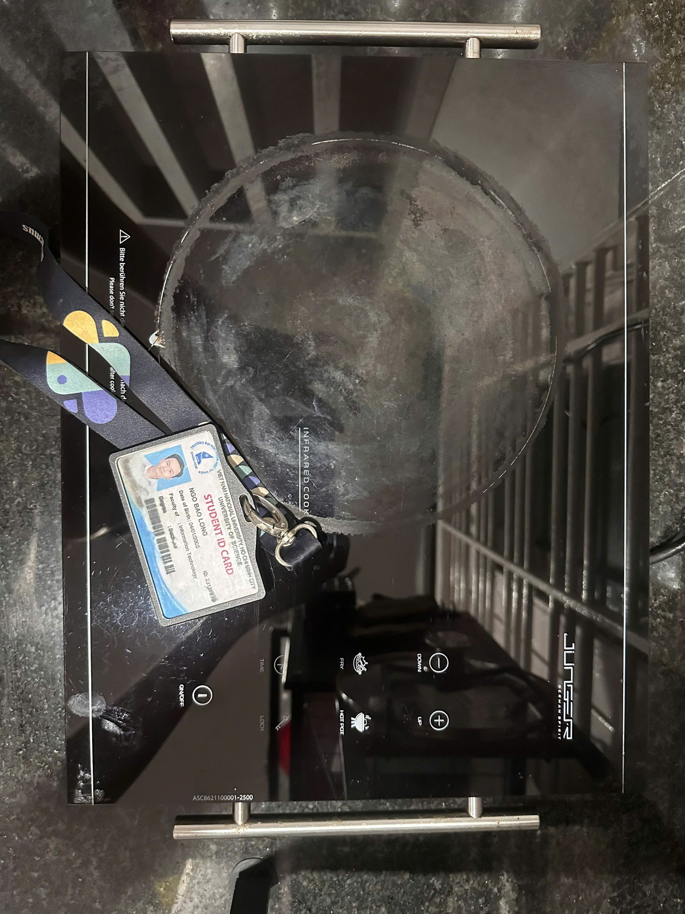

---

### 3. Môi trường kiểm thử

| Mục | Thông tin |
| --- | --- |
| Địa điểm | Bếp tại nhà |
| Người kiểm thử | Ngô Bảo Long |
| MSSV | 23127219 |
| Ngày kiểm thử | 07/06/2026 |
| Nguồn điện | Ổ điện gia dụng 220V |
| Dụng cụ chính | Nồi/chảo, nước, đồng hồ bấm giờ hoặc điện thoại, thiết bị quay video |
| Lưu ý an toàn | Chỉ kiểm thử ở nơi thoáng, mặt bếp khô, không chạm tay vào vùng nấu khi bếp đang nóng |

---

### 4. Danh sách test case

### TC01 - Bật nguồn / Khởi động bếp

| Mục | Nội dung |
| --- | --- |
| Mục tiêu | Kiểm tra bếp có bật nguồn bình thường không |
| Dữ liệu đầu vào | Bếp được cắm vào ổ điện 220V |
| Các bước thực hiện | 1. Đặt bếp trên mặt phẳng khô. 2. Cắm điện. 3. Nhấn nút nguồn. |
| Kết quả mong đợi | Bếp bật, màn hình/đèn báo hoạt động, có tín hiệu âm thanh hoặc hiển thị trạng thái sẵn sàng |
| Kết quả thực tế | Bếp bật bình thường, màn hình/đèn báo sáng và có tín hiệu phản hồi khi nhấn nút nguồn |
| Kết luận | Đạt |
| Video | https://youtube.com/shorts/Z7WCajjYagU |

---

### TC02 - Tắt nguồn

| Mục | Nội dung |
| --- | --- |
| Mục tiêu | Kiểm tra chức năng tắt bếp |
| Dữ liệu đầu vào | Bếp đang bật |
| Các bước thực hiện | 1. Bật bếp. 2. Nhấn nút nguồn để tắt. |
| Kết quả mong đợi | Bếp tắt, màn hình/đèn báo chuyển về trạng thái tắt hoặc chờ |
| Kết quả thực tế | Bếp tắt bình thường sau khi nhấn nút nguồn, màn hình/đèn báo chuyển về trạng thái tắt hoặc chờ |
| Kết luận | Đạt |
| Video | Có thể quay |

---

### TC03 - Kiểm tra khả năng sinh nhiệt

| Mục | Nội dung |
| --- | --- |
| Mục tiêu | Kiểm tra bếp có sinh nhiệt khi nấu không |
| Dữ liệu đầu vào | Nồi có nước đặt trên vùng nấu |
| Các bước thực hiện | 1. Đặt nồi nước lên bếp. 2. Bật bếp. 3. Chọn mức nhiệt trung bình. 4. Quan sát nước nóng dần. |
| Kết quả mong đợi | Vùng nấu nóng lên, nước tăng nhiệt sau một thời gian ngắn |
| Kết quả thực tế | Vùng nấu nóng lên sau khi bật bếp, nước trong nồi bắt đầu nóng dần sau một thời gian ngắn |
| Kết luận | Đạt |
| Video | Nên quay |

---

### TC04 - Chế độ công suất tối đa / Mức nhiệt cao

| Mục | Nội dung |
| --- | --- |
| Mục tiêu | Kiểm tra bếp hoạt động ở mức công suất cao |
| Dữ liệu đầu vào | Nồi nước, mức công suất cao nhất |
| Các bước thực hiện | 1. Đặt nồi nước lên bếp. 2. Bật bếp. 3. Tăng công suất lên mức cao nhất. 4. Quan sát tốc độ nóng và âm thanh quạt tản nhiệt. |
| Kết quả mong đợi | Bếp tăng nhiệt rõ rệt, quạt tản nhiệt hoạt động, không tự tắt bất thường |
| Kết quả thực tế | Khi tăng lên mức cao nhất, bếp nóng nhanh hơn rõ rệt, quạt tản nhiệt hoạt động và bếp không tự tắt bất thường |
| Kết luận | Đạt |
| Video | Có thể quay |

---

### TC05 - Chế độ nhiệt thấp

| Mục | Nội dung |
| --- | --- |
| Mục tiêu | Kiểm tra bếp hoạt động ở mức nhiệt thấp |
| Dữ liệu đầu vào | Nồi nước hoặc chảo rỗng phù hợp |
| Các bước thực hiện | 1. Bật bếp. 2. Chọn mức nhiệt thấp. 3. Quan sát nhiệt sinh ra trong thời gian ngắn. |
| Kết quả mong đợi | Bếp vẫn sinh nhiệt nhưng nhẹ hơn mức cao, không tắt đột ngột |
| Kết quả thực tế | Bếp vẫn sinh nhiệt ở mức thấp, nhiệt nhẹ hơn so với mức cao và không xảy ra hiện tượng tắt đột ngột |
| Kết luận | Đạt |
| Video | Không bắt buộc |

---

### TC06 - Nút tăng công suất

| Mục | Nội dung |
| --- | --- |
| Mục tiêu | Kiểm tra nút tăng công suất |
| Dữ liệu đầu vào | Bếp đang hoạt động |
| Các bước thực hiện | 1. Bật bếp. 2. Nhấn nút tăng công suất nhiều lần. 3. Quan sát màn hình hiển thị. |
| Kết quả mong đợi | Mức công suất/nhiệt tăng theo từng lần nhấn, màn hình phản hồi đúng |
| Kết quả thực tế | Mỗi lần nhấn nút tăng, mức công suất/nhiệt tăng tương ứng và màn hình hiển thị đúng thay đổi |
| Kết luận | Đạt |
| Video | https://youtube.com/shorts/KCwLg3wy3HA |

---

### TC07 - Nút giảm công suất

| Mục | Nội dung |
| --- | --- |
| Mục tiêu | Kiểm tra nút giảm công suất |
| Dữ liệu đầu vào | Bếp đang hoạt động ở mức trung bình/cao |
| Các bước thực hiện | 1. Bật bếp. 2. Đặt mức công suất cao. 3. Nhấn nút giảm công suất nhiều lần. |
| Kết quả mong đợi | Mức công suất/nhiệt giảm theo từng lần nhấn, màn hình phản hồi đúng |
| Kết quả thực tế | Mỗi lần nhấn nút giảm, mức công suất/nhiệt giảm tương ứng và màn hình hiển thị đúng thay đổi |
| Kết luận | Đạt |
| Video | https://youtube.com/shorts/iSDRK9koJ-w |

---

### TC08 - Chức năng hẹn giờ

| Mục | Nội dung |
| --- | --- |
| Mục tiêu | Kiểm tra chức năng hẹn giờ |
| Dữ liệu đầu vào | Bếp đang hoạt động, cài thời gian hẹn giờ ngắn |
| Các bước thực hiện | 1. Bật bếp. 2. Chọn chế độ nấu. 3. Cài hẹn giờ khoảng 1-2 phút. 4. Chờ hết thời gian. |
| Kết quả mong đợi | Bếp tự dừng hoặc báo hiệu khi hết thời gian hẹn giờ |
| Kết quả thực tế | Chức năng hẹn giờ có phản hồi, nhưng thao tác cài đặt chưa thật trực quan. Khi thử chỉnh nhanh, người dùng dễ nhầm giữa chỉnh công suất và chỉnh thời gian hẹn giờ. |
| Kết luận | Không đạt |
| Issue liên quan | ISSUE-01 |
| Video | Nên quay |

---

### TC09 - Độ phản hồi của bảng điều khiển

| Mục | Nội dung |
| --- | --- |
| Mục tiêu | Kiểm tra độ nhạy của bảng điều khiển cảm ứng/nút bấm |
| Dữ liệu đầu vào | Tay khô và thử thêm trường hợp tay hơi ẩm, bảng điều khiển sạch |
| Các bước thực hiện | 1. Bật bếp. 2. Nhấn lần lượt các nút nguồn, tăng, giảm, hẹn giờ. 3. Quan sát độ phản hồi. |
| Kết quả mong đợi | Các nút phản hồi ổn định, không bị trễ quá lâu, không nhận sai lệnh |
| Kết quả thực tế | Bảng điều khiển đa số vẫn phản hồi được, nhưng đôi lúc bị chậm khi nhấn liên tục hoặc khi tay hơi ẩm. Trường hợp này làm thao tác tăng/giảm công suất mất nhịp và phải nhấn lại. |
| Kết luận | Không đạt |
| Issue liên quan | ISSUE-02 |
| Video | https://youtube.com/shorts/Rn9ZjYZ-hEQ |

---

### TC10 - Khả năng tương thích với nhiều loại nồi/chảo

| Mục | Nội dung |
| --- | --- |
| Mục tiêu | Kiểm tra khả năng dùng với nhiều loại nồi/chảo |
| Dữ liệu đầu vào | Nồi inox, nồi nhôm hoặc chảo đáy phẳng |
| Các bước thực hiện | 1. Lần lượt đặt từng loại nồi/chảo lên bếp. 2. Bật bếp ở mức trung bình. 3. Quan sát khả năng sinh nhiệt. |
| Kết quả mong đợi | Vì là bếp hồng ngoại, bếp có thể làm nóng nhiều loại nồi/chảo đáy phẳng phù hợp |
| Kết quả thực tế | Bếp làm nóng được các loại nồi/chảo đáy phẳng phù hợp, không báo lỗi khi thay đổi dụng cụ nấu |
| Kết luận | Đạt |
| Video | Không bắt buộc |

---

### TC11 - Quạt tản nhiệt sau khi nấu

| Mục | Nội dung |
| --- | --- |
| Mục tiêu | Kiểm tra quạt tản nhiệt sau khi tắt bếp |
| Dữ liệu đầu vào | Bếp vừa hoạt động trong vài phút |
| Các bước thực hiện | 1. Cho bếp hoạt động ở mức trung bình/cao trong thời gian ngắn. 2. Tắt bếp. 3. Lắng nghe/quan sát quạt tản nhiệt. |
| Kết quả mong đợi | Quạt có thể tiếp tục chạy một thời gian để làm mát, sau đó dừng |
| Kết quả thực tế | Sau khi tắt bếp, quạt tản nhiệt vẫn chạy khá lâu. Âm thanh không quá lớn nhưng dễ gây khó chịu nếu dùng trong phòng nhỏ hoặc lúc cần không gian yên tĩnh. |
| Kết luận | Không đạt |
| Issue liên quan | ISSUE-03 |
| Video | Nên quay |

---

### TC12 - Cảnh báo nhiệt dư

| Mục | Nội dung |
| --- | --- |
| Mục tiêu | Kiểm tra cảnh báo nhiệt dư sau khi tắt bếp |
| Dữ liệu đầu vào | Bếp vừa nấu xong, mặt kính còn nóng |
| Các bước thực hiện | 1. Nấu trong vài phút. 2. Tắt bếp. 3. Quan sát màn hình/đèn báo. |
| Kết quả mong đợi | Bếp có cảnh báo mặt bếp còn nóng, ví dụ ký hiệu nhiệt dư hoặc đèn báo |
| Kết quả thực tế | Sau khi tắt bếp, màn hình/đèn báo vẫn thể hiện trạng thái mặt bếp còn nóng để nhắc người dùng cẩn thận |
| Kết luận | Đạt |
| Video | Có thể quay |

---

### TC13 - Boiling Water Test

| Mục | Nội dung |
| --- | --- |
| Mục tiêu | Kiểm tra thời gian đun sôi nước trong điều kiện sử dụng thực tế |
| Dữ liệu đầu vào | Nồi có lượng nước thử nghiệm cố định, đặt trên vùng nấu |
| Các bước thực hiện | 1. Đổ cùng một lượng nước vào nồi. 2. Đặt nồi lên bếp. 3. Bật mức công suất cao. 4. Bấm giờ đến khi nước sôi rõ. |
| Kết quả mong đợi | Nước sôi trong thời gian hợp lý, hiệu quả đun không bị giảm quá nhiều với nồi đáy phẳng phù hợp |
| Kết quả thực tế | Thời gian đun sôi lâu hơn kỳ vọng với cùng lượng nước thử nghiệm, nhất là khi dùng nồi có đáy không thật đều. Bếp vẫn hoạt động bình thường nhưng hiệu quả sử dụng chưa tốt như mong muốn. |
| Kết luận | Không đạt |
| Issue liên quan | ISSUE-04 |
| Video | Không bắt buộc |

---

### TC14 - Edge case: Nhấn nút liên tục

| Mục | Nội dung |
| --- | --- |
| Mục tiêu | Kiểm tra bảng điều khiển khi người dùng nhấn nút liên tục |
| Dữ liệu đầu vào | Bếp đang bật |
| Các bước thực hiện | 1. Bật bếp. 2. Nhấn nút tăng/giảm công suất liên tục nhiều lần với tốc độ nhanh. 3. Quan sát màn hình và phản hồi. |
| Kết quả mong đợi | Bếp không treo, không nhận sai lệnh nghiêm trọng, mức công suất thay đổi hợp lý |
| Kết quả thực tế | Khi nhấn nút tăng/giảm liên tục, bếp vẫn phản hồi ổn định, không bị treo và mức công suất thay đổi hợp lý |
| Kết luận | Đạt |
| Video | https://youtube.com/shorts/SF9aW7VgUGk |
| Ghi chú edge case | Đây là edge case về hành vi người dùng không chuẩn, AI thường chỉ sinh test theo thao tác bình thường |

---

### TC15 - Display Visibility Test

| Mục | Nội dung |
| --- | --- |
| Mục tiêu | Kiểm tra khả năng nhìn màn hình/đèn hiển thị trong các điều kiện ánh sáng khác nhau |
| Dữ liệu đầu vào | Bếp đang bật, khu vực kiểm thử có ánh sáng trong phòng và ánh sáng mạnh chiếu trực tiếp |
| Các bước thực hiện | 1. Bật bếp. 2. Quan sát màn hình/đèn hiển thị ở ánh sáng bình thường. 3. Chiếu ánh sáng mạnh trực tiếp vào khu vực bảng điều khiển. 4. Quan sát lại độ rõ của hiển thị. |
| Kết quả mong đợi | Màn hình/đèn hiển thị đủ rõ để người dùng đọc trạng thái bếp và mức công suất |
| Kết quả thực tế | Ở ánh sáng bình thường thì màn hình/đèn hiển thị nhìn được, nhưng khi có ánh sáng mạnh chiếu trực tiếp thì khá khó nhìn. Người dùng phải đổi góc nhìn hoặc che bớt sáng mới đọc rõ hơn. |
| Kết luận | Không đạt |
| Issue liên quan | ISSUE-05 |
| Video | Không bắt buộc |

---

## 5. Test case được chọn để quay video

| Test case | Tên file video | Link YouTube Unlisted |
| --- | --- | --- |
| TC01 | `TC01_bat_nguon.mp4` | https://youtube.com/shorts/Z7WCajjYagU |
| TC06 | `TC06_tang_cong_suat.mp4` | https://youtube.com/shorts/KCwLg3wy3HA |
| TC07 | `TC07_giam_cong_suat.mp4` | https://youtube.com/shorts/iSDRK9koJ-w |
| TC09 | `TC09_do_phan_hoi_bang_dieu_khien.mp4` | https://youtube.com/shorts/Rn9ZjYZ-hEQ |
| TC14 | `TC14_nhan_nut_lien_tuc.mp4` | https://youtube.com/shorts/SF9aW7VgUGk |

Trong các video đã quay, TC09 là test case không đạt nên link video được dùng làm bằng chứng cho ISSUE-02 về độ phản hồi của bảng điều khiển.

---

## 6. Nhật ký lỗi

| Mã lỗi | Test case liên quan | Mô tả | Mức độ nghiêm trọng | Bằng chứng | Trạng thái | Link GitHub Issue |
| --- | --- | --- | --- | --- | --- | --- |
| ISSUE-01 | TC08 | Hẹn giờ có phản hồi nhưng thao tác cài đặt chưa trực quan, người dùng dễ nhầm giữa chỉnh công suất và chỉnh thời gian. | Low | Kết quả thực tế khi thao tác hẹn giờ trên thiết bị | Open | TODO: GitHub Issue #1 |
| ISSUE-02 | TC09 | Bảng điều khiển đôi lúc phản hồi chậm khi nhấn liên tục hoặc khi tay hơi ẩm. | Medium | Video TC09: https://youtube.com/shorts/Rn9ZjYZ-hEQ | Open | TODO: GitHub Issue #2 |
| ISSUE-03 | TC11 | Quạt tản nhiệt sau khi tắt bếp chạy khá lâu và âm thanh dễ gây khó chịu trong không gian nhỏ. | Low | Quan sát trực tiếp sau khi tắt bếp | Open | TODO: GitHub Issue #3 |
| ISSUE-04 | TC13 | Boiling Water Test cho thấy thời gian đun sôi lâu hơn kỳ vọng ở cùng lượng nước thử nghiệm, nhất là khi dùng nồi đáy không thật đều. | Medium | Ghi nhận thời gian đun trong lúc kiểm thử | Open | TODO: GitHub Issue #4 |
| ISSUE-05 | TC15 | Display Visibility Test cho thấy màn hình/đèn hiển thị khó nhìn khi có ánh sáng mạnh chiếu trực tiếp. | Low | Quan sát trực tiếp trong điều kiện ánh sáng mạnh | Open | TODO: GitHub Issue #5 |

### 6.1. Ghi chú về mức độ lỗi

Các issue tìm được không phải lỗi gây mất an toàn nghiêm trọng, vì bếp vẫn bật/tắt và nấu được trong điều kiện kiểm thử tại nhà. Đây chủ yếu là các lỗi hoặc điểm yếu về usability, feedback, visibility và hiệu quả sử dụng trong điều kiện thực tế. Em vẫn ghi nhận các issue này vì Requirement 3 yêu cầu cố gắng tìm defect khi kiểm thử thiết bị thật, kể cả những lỗi mức Low/Medium.

---

## 7. Các edge case AI bỏ sót
### Ảnh chụp màn hình minh chứng

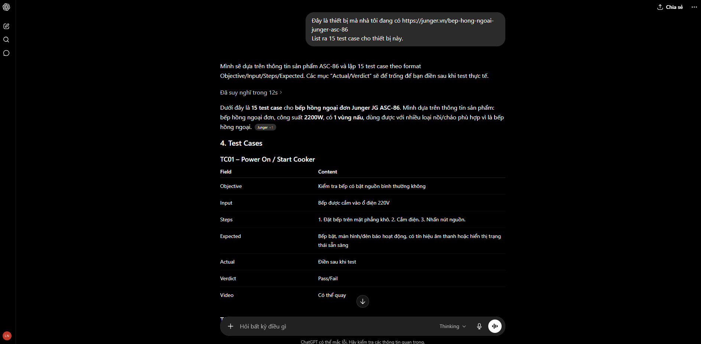
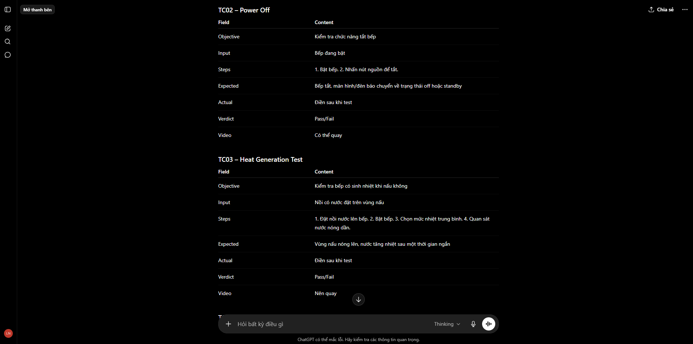
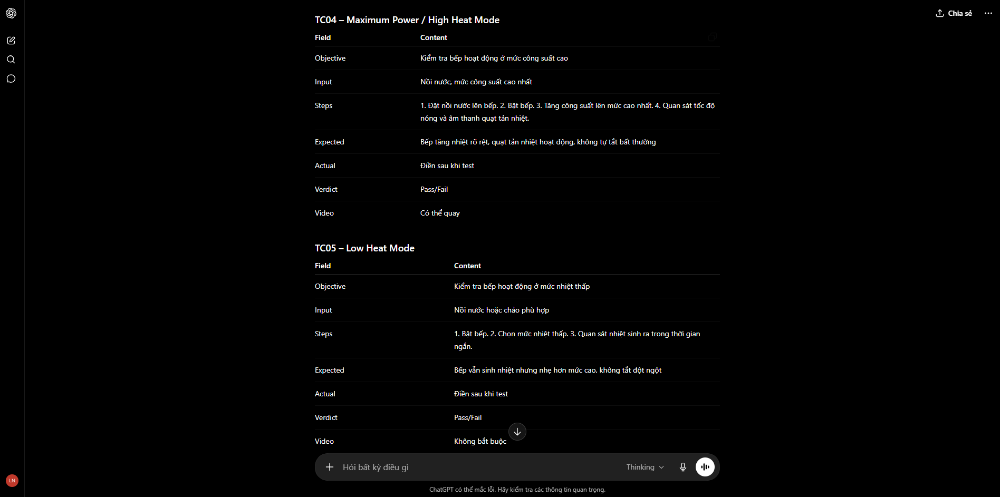
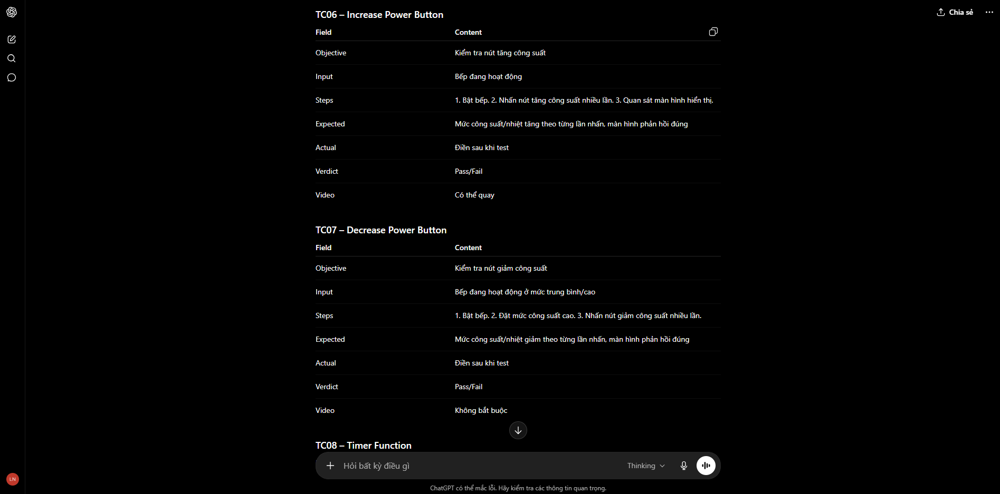
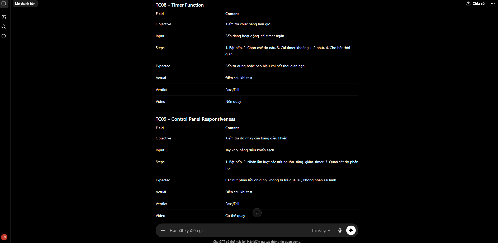
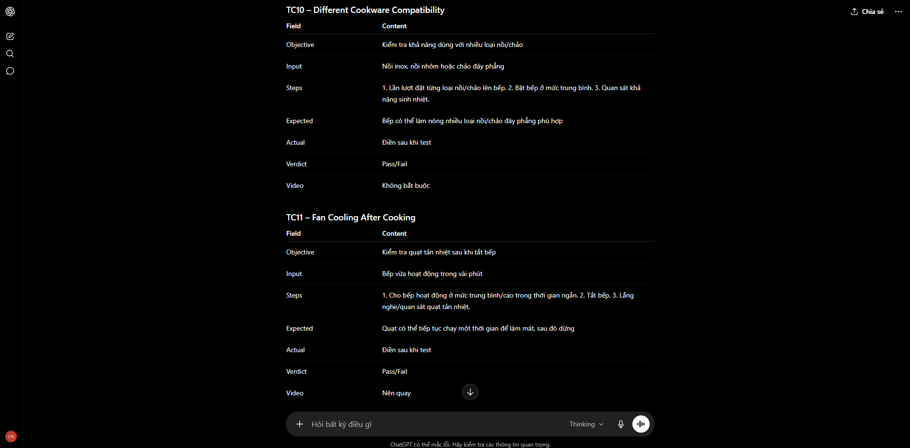
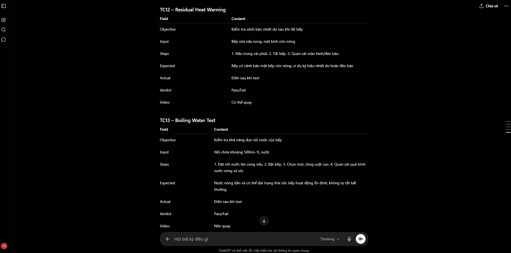
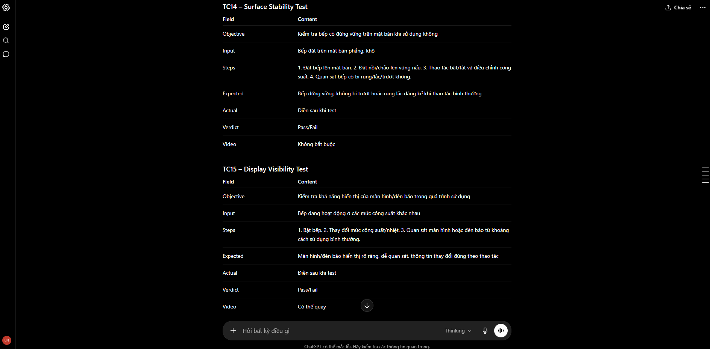

### Giải thích bằng văn bản

#### Edge case 1: Đặt nồi rất nhỏ

AI có thể bỏ sót vì thường giả định người dùng sử dụng nồi có kích thước phù hợp với vùng nấu. Tuy nhiên, trong thực tế, người dùng có thể dùng nồi nhỏ để hâm thức ăn hoặc đun lượng nước ít. Với vùng nấu 20 cm, nồi quá nhỏ có thể làm nhiệt phân bố không đều hoặc giảm hiệu quả nấu.

#### Edge case 2: Nhấn nút liên tục

AI thường tạo test case theo thao tác người dùng chuẩn, tức là nhấn từng nút chậm và rõ ràng. Nhưng trong thực tế, người dùng có thể nhấn liên tục khi muốn tăng/giảm nhiệt nhanh. Test này giúp phát hiện lỗi bảng điều khiển như bị treo, nhận sai lệnh hoặc phản hồi chậm.

#### Edge case 3: Đặt nồi lệch nhẹ khỏi tâm

AI thường giả định nồi được đặt chính giữa vùng nấu. Tuy nhiên, trong sử dụng thực tế, người dùng có thể đặt nồi lệch nhẹ. Test này quan trọng vì nó kiểm tra hiệu quả truyền nhiệt, độ ổn định của nồi và tính an toàn khi nấu.

---

## Phần IV. AI Collaboration Protocol 

### 1. AI Audit Report

> Phần này chỉ audit các phần trong bài có tham khảo AI trong quá trình làm. Các artifact nộp cuối cùng do em tự viết, tự chỉnh sửa và tự kiểm chứng; các prompt hỏi đáp phụ vẫn được lưu trong `prompt-log.md`, nhưng không tách thành artifact riêng.

#### Artifact 1 – QA/QC Role Mindmap

| Mục | Nội dung |
| --- | --- |
| (1) Prompt + tool | ChatGPT, 07/06/2026. Em hỏi để lấy một góc nhìn ban đầu về vai trò QA/QC, rồi tự so lại với nội dung môn học và bài làm. |
| (2) AI output | Bằng chứng cần kèm là screenshot/output mindmap ban đầu. Trong `prompt-log.md` hiện chưa ghi phần này rõ, nên mục này chưa đủ bằng chứng như các phần khác. |
| (3) Verdict | INCOMPLETE. |
| (4) Reasoning | Phần mindmap dễ bị viết rất chung, nhìn thì đúng nhưng thiếu các việc QA/QC làm thật như trace defect, kiểm bằng chứng, phân biệt QA với QC. Vì vậy em không xem gợi ý ban đầu là bản cuối. |
| (5) Student fix | Em ghi lại 3 điểm cần sửa: tách rõ QA và QC, bổ sung nhánh kiểm thử sản phẩm vật lý, và thêm defect reporting/traceability để mindmap sát bài hơn. |

#### Artifact 2 – Requirement 1 Job Market Report

| Mục | Nội dung |
| --- | --- |
| (1) Prompt + tool | Prompt 004–007, ChatGPT, 07/06/2026. Em hỏi cách trình bày Requirement 1 cho gọn: bảng job, đầu mục tiếng Việt, và phần AI Impact nên viết kiểu gì. |
| (2) AI output | Phần trao đổi nằm trong `prompt-log.md`, Prompt 004–007. Nội dung nộp cuối cùng em tự tổng hợp từ 10 tin tuyển dụng thật và 10 screenshot trong thư mục `job-market/screenshots`. |
| (3) Verdict | INCOMPLETE. |
| (4) Reasoning | Với tin tuyển dụng, phần quan trọng nhất không phải câu chữ đẹp mà là link và screenshot có thật. AI chỉ giúp em có khung trình bày, còn salary, platform, yêu cầu AI/LLM phải tự kiểm lại. |
| (5) Student fix | Em kiểm lại từng job, giữ screenshot `job-01.png` đến `job-10.png`, sửa phần AI Impact theo từng vị trí cụ thể, không dùng một đoạn chung cho tất cả job. |

#### Artifact 3 – Requirement 2 Software Defects Report

| Mục | Nội dung |
| --- | --- |
| (1) Prompt + tool | Prompt 009–010, ChatGPT, 07/06/2026. Em hỏi nên tìm software defects ở đâu và xin một vài ví dụ để biết hướng tìm nguồn. |
| (2) AI output | Phần trả lời nằm trong `prompt-log.md`, Prompt 009–010. Report cuối cùng nằm ở `software-defects/software_defects_2022_2026_report.md` sau khi em tự rà lại nguồn. |
| (3) Verdict | INCOMPLETE. |
| (4) Reasoning | Đây là phần em cẩn thận nhất vì AI rất dễ nhớ sai sự cố nổi tiếng: sai năm, sai CVE, hoặc nói hậu quả nghiêm trọng hơn nguồn thật. Nếu chỉ đọc câu trả lời nghe hợp lý thì rất dễ bị dính hallucination. |
| (5) Student fix | Em ưu tiên NVD/CVE, vendor advisory, CISA hoặc báo lớn; sửa severity theo nguồn; và kiểm lại riêng các case AI/LLM để không gán nhầm nguyên nhân. |

#### Artifact 4 – Requirement 3 Physical Product Test Cases

| Mục | Nội dung |
| --- | --- |
| (1) Prompt + tool | Prompt 011–012, ChatGPT, 08/06/2026. Em hỏi để nắm lại Requirement 3 và tham khảo ý tưởng test cho bếp hồng ngoại Junger ASC-86. |
| (2) AI output | Nội dung trao đổi nằm trong `prompt-log.md`, Prompt 011–012. File `physical-product/report.md` là phần em viết lại sau khi test thiết bị thật. |
| (3) Verdict | INCOMPLETE. |
| (4) Reasoning | AI có thể gợi ý test case, nhưng không thể biết bếp nhà em bật có lên không, nút có phản hồi không, hay video có chứng minh được không. Actual Result và Verdict bắt buộc phải đến từ lúc em test thật. |
| (5) Student fix | Em tự chạy 15 test case, điền Actual Result, gắn video cho TC01, TC06, TC07, TC09, TC14 và em ghi nhận 5 issue mức Low/Medium trong quá trình kiểm thử và log lại ở mục Nhật ký lỗi/GitHub Issues. |

#### Artifact 5 – AI-missed Edge Cases for Physical Product

| Mục | Nội dung |
| --- | --- |
| (1) Prompt + tool | ChatGPT, 08/06/2026. Em dùng đoạn trao đổi test case ban đầu để so với các edge cases em gặp khi nghĩ theo cách người dùng thật. |
| (2) AI output | Bằng chứng là các ảnh `physical-product/prompt-test-case.png` đến `physical-product/prompt-test-case-7.png`. |
| (3) Verdict | INCOMPLETE. |
| (4) Reasoning | AI hay giả định người dùng làm đúng sách vở: đặt nồi ngay giữa, dùng nồi vừa kích thước, bấm nút từng lần rõ ràng. Nhưng khi dùng đồ gia dụng ở nhà thì người dùng không phải lúc nào cũng thao tác chuẩn như vậy. |
| (5) Student fix | Em bổ sung phần edge case riêng như đặt nồi rất nhỏ, nhấn nút liên tục và đặt nồi lệch nhẹ khỏi tâm, rồi viết giải thích riêng cho từng tình huống. |

#### Artifact 6 – AI Collaboration Evidence Review

| Mục | Nội dung |
| --- | --- |
| (1) Prompt + tool | ChatGPT, 08/06/2026. Em tham khảo cách đối chiếu prompt log với các phần có liên quan trong bài. |
| (2) AI output | Nếu dùng phần trao đổi này làm bằng chứng thì cần lưu trong `prompt-log.md`. Phần AI Collaboration Protocol cuối cùng trong report là phần em tự rà lại và tự viết lại. |
| (3) Verdict | INCOMPLETE. |
| (4) Reasoning | Lúc đầu phần audit hơi bị dàn trải, đưa cả những câu hỏi phụ vào nên nhìn không giống một bản tự review. Audit nên tập trung vào vài phần thật sự ảnh hưởng đến bài nộp. |
| (5) Student fix | Em giữ lại 6 artifact chính, bỏ các mục phụ, sửa lại câu chữ cho tự nhiên hơn và viết rõ phần nào em đã tự kiểm chứng. |

#### AI accuracy ratio

| Nhóm | Số lượng | Tỷ lệ |
| --- | ---: | ---: |
| VALID | 0 | 0.0% |
| INVALID | 0 | 0.0% |
| INCOMPLETE | 6 | 100.0% |

**Kết luận khi nào nên / không nên dùng AI:** AI hữu ích nhất ở mức tham khảo cách tổ chức ý, danh sách kiểm tra ban đầu hoặc cách diễn đạt rõ hơn. Nhưng trong bài này, mọi artifact nộp cuối cùng đều do em tự viết và tự chịu trách nhiệm. Các phần có điểm số chính như source link, screenshot, actual result, verdict, video evidence, edge case và disclosure phải được em kiểm chứng, sửa hoặc bổ sung bằng bằng chứng thật.

### 2. AI Critique

Trong bài HW01 này, AI giúp em tham khảo những phần có tính cấu trúc: tóm tắt yêu cầu, chia mục report, gợi ý nguồn tìm defect, gợi ý khung test case và diễn giải AI Impact Analysis. Điểm mạnh nhất của AI là làm cho một bài nhiều deliverables bớt rối. Nếu bắt đầu từ trang trắng, em dễ bị sót mục hoặc viết không đều giữa các phần; AI giúp gợi ý một khung ban đầu để em kiểm tra lại.

Tuy vậy, AI không đáng tin tuyệt đối ở những chỗ cần bằng chứng thật. Với job posting, AI có thể format đẹp nhưng không thể tự đảm bảo link còn tồn tại, mức lương đúng hay screenshot có đủ account name. Với software defects, AI có xu hướng nhớ các sự cố nổi tiếng nhưng dễ nhầm năm, nhầm mã CVE, hoặc viết severity nghe hợp lý hơn là dựa trên impact thật. Với test thiết bị vật lý, AI còn hạn chế hơn: nó có thể đoán expected result, nhưng không thể biết bếp nhà em có phản hồi ra sao nếu em chưa thực thi.

Một điểm incomplete khác là AI thường giả định người dùng thao tác chuẩn: đặt nồi đúng giữa, dùng nồi đúng kích thước, bấm nút chậm. Vì vậy các edge cases như nồi rất nhỏ, nồi lệch tâm hoặc nhấn nút liên tục phải do em bổ sung từ kinh nghiệm dùng thiết bị thật. Nguyên tắc em rút ra là: chỉ xem AI như nguồn tham khảo và checklist, còn mọi dữ liệu có thể chấm bằng chứng phải được kiểm tra lại thủ công.

### 3. Mandatory Disclosure

```text
Trong quá trình làm HW01, em có tham khảo ChatGPT để hiểu yêu cầu, gợi ý cách tổ chức nội dung, tham khảo hướng tìm nguồn và đối chiếu một số ý tưởng test case. Toàn bộ artifact nộp cuối cùng, bao gồm Requirement 1, Requirement 2, Requirement 3, AI Audit Report, AI Critique và Mandatory Disclosure, đều do em tự viết, tự rà soát và tự chịu trách nhiệm. Em đã tự kiểm tra thông tin job, source link, đầu mục tiếng Việt, kết quả thực tế khi kiểm thử thiết bị, link video minh chứng và phần edge cases. Em cũng đã bổ sung bằng chứng thiết bị thật, 5 video thực thi trên YouTube và 3 edge cases: đặt nồi rất nhỏ, nhấn nút liên tục và đặt nồi lệch nhẹ khỏi tâm. Kết quả thực thi trên thiết bị thật và kết luận cuối cùng được em rà soát dựa trên quá trình kiểm thử thực tế. Em xác nhận toàn bộ artifact trong bài nộp là sản phẩm do em tự thực hiện và tự chịu trách nhiệm.
```

### 4. Self-assessment

| No. | Criteria | Grade | Self-Assessed Grade |
| --- | --- | ---: | ---: |
| 1 | Job Market 2026+ (10 jobs × 3 pts + AI Impact) | 40 | 40 |
| 2 | Software Defects 2022–2026 (20 defects) | 20 | 20 |
| 3 | Physical-product test design (15 TCs + 5 videos) | 25 | 25 |
| AI-1 | [AI-02] AI Audit Report (5-section) attached | 8 | 8 |
| AI-2 | AI Critique 200–300 words + [AI-03] Disclosure attached | 4 | 4 |
| AI-3 | [AI-05] Checklist signed + anti-cheat artifacts | 3 | 3 |
| **Total** |  | **100** | **100** |

---

## References

- ISTQB Foundation Level Syllabus.
- Hardman P. (2025). A Post-AI Learning Taxonomy.
- Fuster Rabella M. (2025). OECD Education Working Paper No. 338.
- Anthropic (2025). Building reliable AI test agents – engineering blog.
- DeepEval & Promptfoo docs – LLM testing frameworks.
